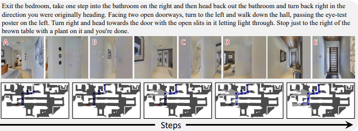

## Benchmark Introduction



RxR was ported to continuous environments originally for the RxR-Habitat Challenge. The dataset has train, val_seen, val_unseen, and test_challenge splits with both Guide and Follower trajectories ported.

## Benchmark Statistics

## Benchmark Evaluation

## Citation

```
@inproceedings{krantz_vlnce_2020,
  title={Beyond the Nav-Graph: Vision and Language Navigation in Continuous Environments},
  author={Jacob Krantz and Erik Wijmans and Arjun Majundar and Dhruv Batra and Stefan Lee},
  booktitle={European Conference on Computer Vision (ECCV)},
  year={2020}
 }

```
