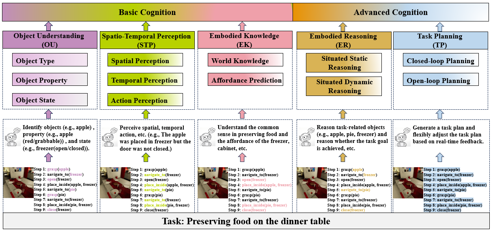
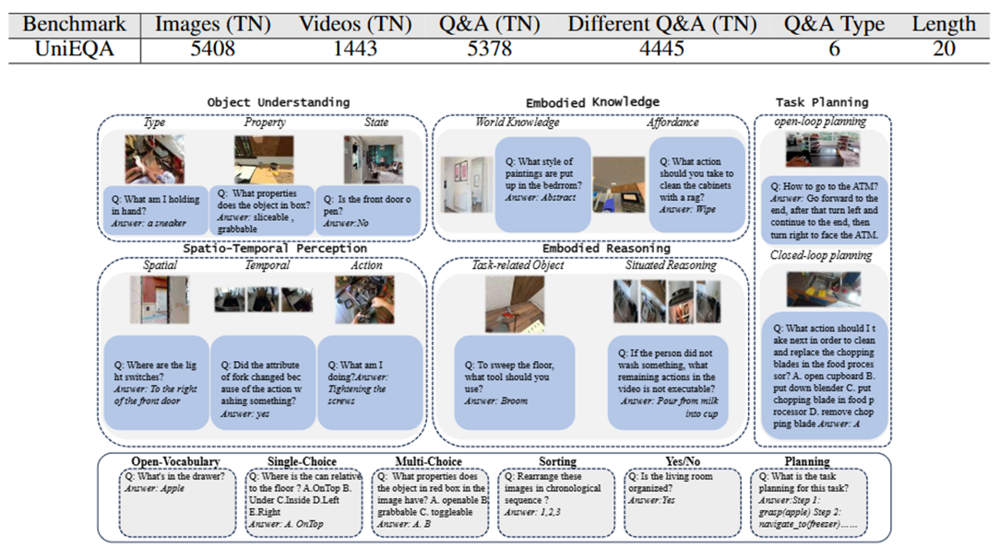
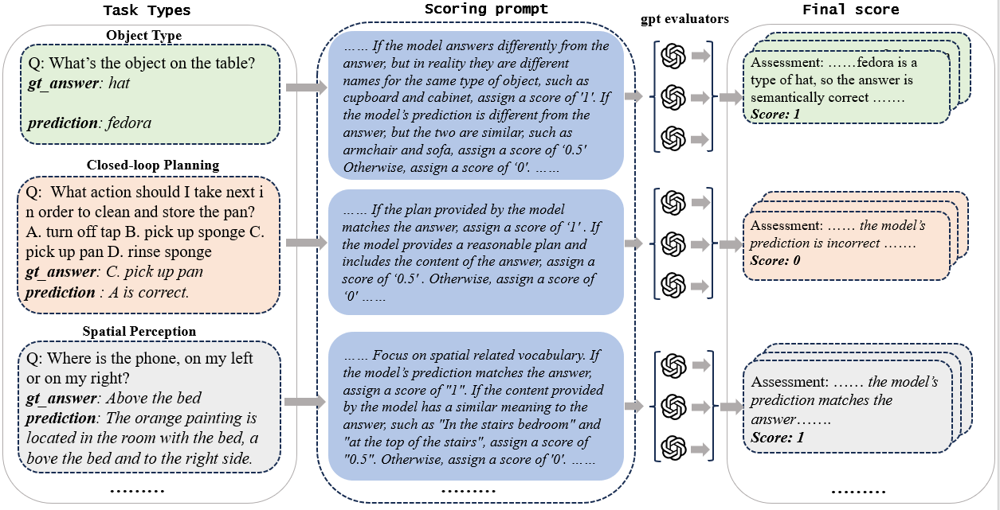

## Introduction



UniEQA, a new unified evaluation benchmark for embodied artificial intelligence, is designed to evaluate MLLMs in terms of 5 core capabilities with 12 detailed dimensions. The benchmark is established based on seven heterogeneous data sources, covering simulated and real-world scenarios. The benchmark contains a total of 5378 question-answer pairs, of which 4445 are completely different questions format. By integrating multiple existing EQA benchmarks with newly annotated datasets and performing manual review, UniEQA effectively ensures its reliability, comprehensiveness and diversity.
## Benchmark characteristics

- **Broad Coverage of Capabilities**: It encompasses 5 core capabilities – object understanding, spatiotemporal perception, embodied knowledge, embodied reasoning, and task planning – and achieves a hierarchical and detailed evaluation from basic cognition to advanced cognitive abilities.
- **High Data Quality**: It covers 7 data sources, including both simulation and real-world data. It integrates 5 high-quality, multi-modal evaluation datasets in the embodied AI domain and includes 1 newly annotated evaluation dataset, providing a total of over 5000 Q&A Pairs.
- **Rich Data Types**: It covers multiple data types, including single images, multiple images, videos, and text, as well as 6 types of question-answering instructions such as multiple-choice and sorting.
- **Flexible Extensibility**: It supports flexible and convenient addition of evaluation datasets.
- **Automated Evaluation**: It constructs corresponding scoring rules and a unified automated evaluation method for different capability dimensions.

## Data Statistics

- Data Collection: simulation (VirtualHome, BEHAVIOR-100, AI2-THOR)

  

## Evaluation



This paper proposes a novel LLM-based evaluation method to improve the efficiency of the evaluation process.

- Evaluation data: This work compares only two candidate answers to minimize LLM bias and tries to make the LLM make more objective decisions based on the semantics and logic of the candidate answers.
- Evaluation rule: This work customizes rule prompts for each capability dimension for a more reasonable and accurate evaluation.
- Evaluation results: This work uses the high-performance, low-overhead GPT-4o-mini as the LLM of evaluation. To avoid accidental errors, it independently evaluates each Q&A pair three times and then takes the average as the final evaluation result.

## Citation

```
@article{UniEQA2025,
  title={UniEQA & UniEval: A Unified Benchmark and Evaluation Platform for  Multimodal Foundation Models in Embodied Question Answering},
  year={2025}
}
```
