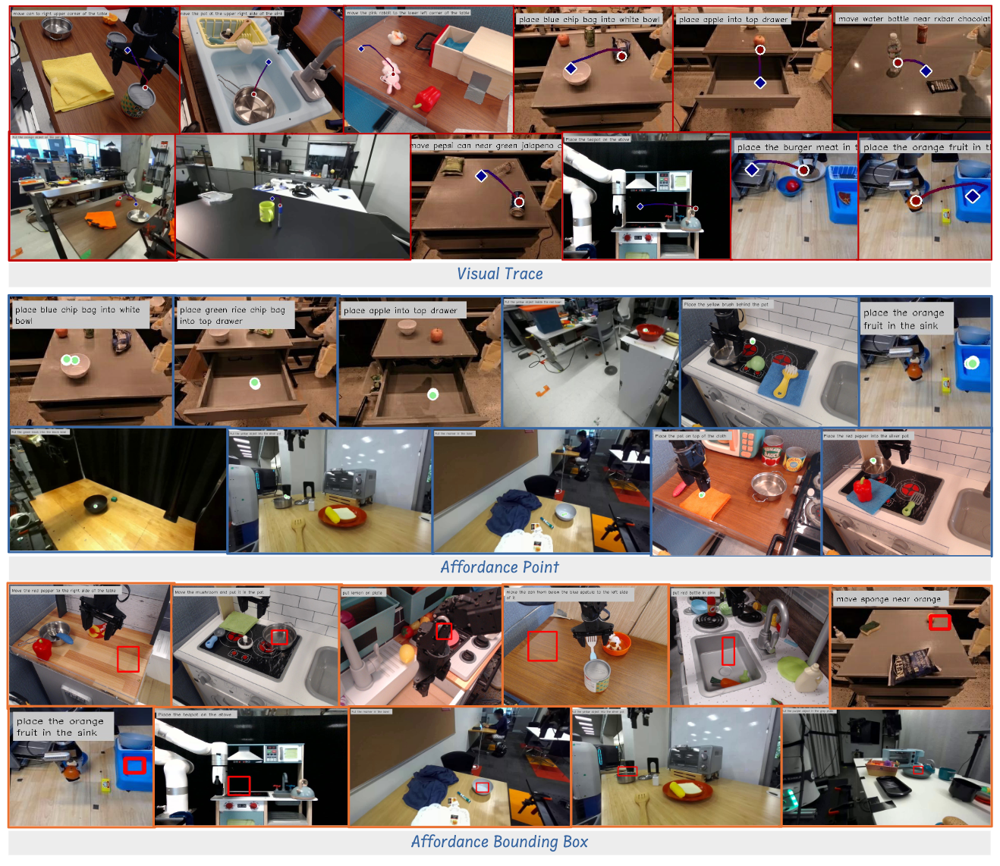

## Introduction



VABench, a challenging benchmark with 300 manually annotated problems from real-world and simulation datasets (OXE, BridgeData, Droid). VABench evaluates models' abilities to generate spatial affordance and visual traces from natural language instructions, using metrics including point accuracy, trajectory MAE/RMSE, and GPT-based qualitative scoring.

## Data Statistics

VABench contains **300 manually annotated problems** sourced from multiple renowned robotic manipulation datasets:

| Dataset | Type | Characteristics |
|---------|-------------------|------|
| **OXE** | Real-world | Diverse real robotic manipulation scenarios |
| **BridgeData** | Real-world | Dataset bridging language and robotic actions |
| **Droid** | Real-world | High-quality simulated robotic manipulation data |

- **Task Diversity**: Covers various robotic manipulation tasks including grasping, placing, pushing, pulling, and assembly
- **Instruction Complexity**: Ranges from simple direct commands to complex multi-step operation instructions
- **Environmental Complexity**: Includes diverse real-world scenarios such as homes, offices, and industrial settings

## Evaluation

### Evaluation Task Types

VABench is designed with two core evaluation tasks:

#### 1. Spatial Affordance Assessment (VABench-Point)
Evaluates models' spatial understanding capabilities of target regions by measuring the overlap between predicted points and target areas.

- **Evaluation Method**: Calculate the proportion of predicted points falling within target regions
- **Boundary Handling**: For models that only output bounding boxes, uniform sampling within boxes is performed

##### Quantitative Metrics
- **Accuracy**: If the predicted point falls within the target area of the answer, it is considered correct; otherwise, it is considered incorrect.


#### 2. Visual Trace Prediction (VABench-VisualTrace)
Evaluates models' ability to predict complete manipulation trajectories using mathematical metrics to quantify trajectory accuracy.

##### Quantitative Metrics
- **MAE (Mean Absolute Error)**: $MAE = \frac{1}{T} \sum_{t=1}^{T} \|x_t - \hat{x_t}\|$
- **RMSE (Root Mean Square Error)**: $RMSE = \sqrt{\frac{1}{T} \sum_{t=1}^{T} \|x_t - \hat{x_t}\|^2}$

where $\tau = \{x_t | t = 1,2,...,T\}$ represents the ground truth trajectory and $\hat{\tau} = \{\hat{x_t} | t = 1,2,...,\hat{T}\}$ represents the predicted trajectory.

- **GPT Score**: Uses large language models to provide qualitative assessment of visualized trajectories on a 1-10 scale. The **Evaluation Dimensions** include: 
  - Trajectory reasonableness
  - Consistency with instructions
  - Operation feasibility
  - Safety considerations

## Citation

```
@misc{yuan2025seeingdoingbridgingreasoning,
      title={From Seeing to Doing: Bridging Reasoning and Decision for Robotic Manipulation}, 
      author={Yifu Yuan and Haiqin Cui and Yibin Chen and Zibin Dong and Fei Ni and Longxin Kou and Jinyi Liu and Pengyi Li and Yan Zheng and Jianye Hao},
      year={2025},
      eprint={2505.08548},
      archivePrefix={arXiv},
      primaryClass={cs.RO},
      url={https://arxiv.org/abs/2505.08548}, 
}
```
