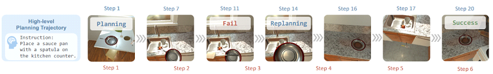

## Benchmark Introduction



We develop EB-ALFRED based on the ALFRED dataset and the AI2-THOR simulator. Our simulator is based on Lota-Bench’s implementation for 8 highlevel skill types: “pick up”, “open”, “close”, “turn on”, “turn off”, “slice”, “put down”, and “find”, each customizable with specific objects, for example, “find an apple”. The simulator provides an egocentric view as observation, along with textual feedback on action validity and possible failure reasons. Despite its strengths, Lota-Bench’s simulator has several limitations. To enhance the simulation, we introduced key improvements, such as support for multiple instances of the same object type, allowing us to cover all task types in ALFRED. Additionally, we streamlined the action space by merging “put down” actions into a single action, since only one object can be held at a time. Due to the varying number of objects in ALFRED, the action space of EB-ALFRED is dynamic, ranging from 171 to 298 actions. Furthermore, we manually corrected simulator errors and refined instruction quality, ensuring more accurate action execution and improved task solvability. These enhancements make EB-ALFRED a highquality benchmark for evaluating embodied agents

## Benchmark characteristics

## Benchmark Statistics

## Benchmark Evaluation

## Citation

```
@article{yang2025embodiedbench,
  title={EmbodiedBench: Comprehensive Benchmarking Multi-modal Large Language Models for Vision-Driven Embodied Agents},
  author={Yang, Rui and Chen, Hanyang and Zhang, Junyu and Zhao, Mark and Qian, Cheng and Wang, Kangrui and Wang, Qineng and Koripella, Teja Venkat and Movahedi, Marziyeh and Li, Manling and others},
  journal={arXiv preprint arXiv:2502.09560},
  year={2025}
}

```
