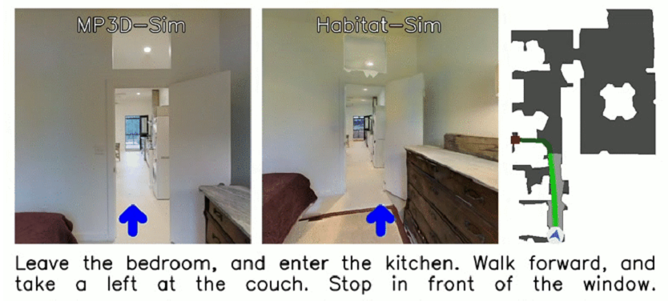

## Introduction



VLN-CE R2R dataset consists of 4475 trajectories. For each trajectory, R2R-CE provides the multiple natural language instructions from R2R and a pre-computed shortest path following the waypoints via low-level actions. The low-level action space of VLN-CE R2R makes trajectories significantly longer horizon tasks – with an average of 55.88 steps compared to the 4-6 in R2R.

## Evaluation

- Download the repo and set-up the environment: https://github.com/jzhzhang/NaVid-VLN-CE

- Succesfully run eval_navid_vlnce.sh

- Since package "transformers" in the qwen conda environment is not compatible with the vlnce_navid conda environment. So use "flask run" of the file app.py to start a server and then access this server API in the evaluation pipeline. Please change "app.run(host="x.x.x.x",port=5558)" in the file "app.py" and 'URL_MAPPING = {"Qwen2.5-VL-7B-Instruct": "http://x.x.x.x:x/predict",}' in the file "base_agent.py"

- Then add files in the current repo into the above repo

- Set closed-source large language model keys in the environment variable and then use "os.environ" in the file "base_agent.py"

- run "sh eval_base_vlnce.sh --model gpt-4o --config rxr"

1. **Success Rate**: The percentage of episodes in which the agent successfully navigates to a goal location within a specified threshold distance. This metric reflects the agent's ability to reach the correct destination.
2. **Oracle Success Rate**: The percentage of episodes where at least one point along the agent's trajectory comes within the goal threshold distance. It indicates whether the agent could have succeeded under an optimal stopping policy.
3. **SPL**: A metric that balances success with efficiency. It penalizes longer-than-necessary trajectories by weighting the success rate with the ratio between the shortest path length and the actual path length. Higher SPL implies that the agent not only reaches the goal but does so efficiently.

## Citation

```
@inproceedings{krantz_vlnce_2020,
  title={Beyond the Nav-Graph: Vision and Language Navigation in Continuous Environments},
  author={Jacob Krantz and Erik Wijmans and Arjun Majundar and Dhruv Batra and Stefan Lee},
  booktitle={European Conference on Computer Vision (ECCV)},
  year={2020}
}

```
