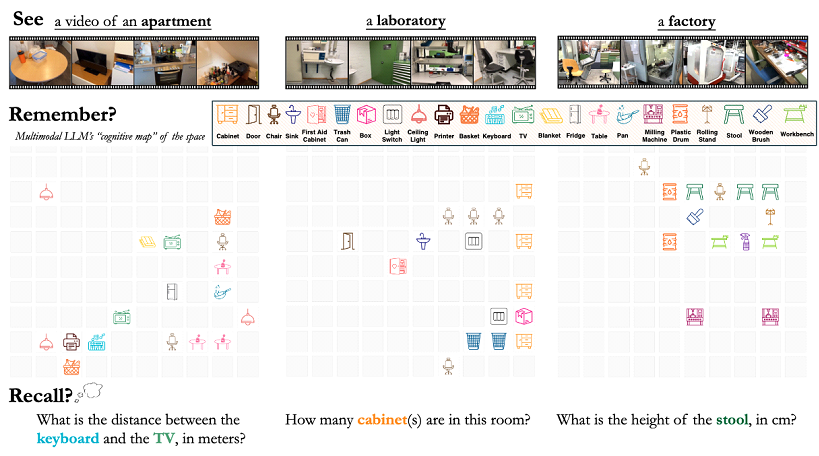

## Benchmark Introduction



VSI-Bench quantitatively evaluates the visual-spatial intelligence of MLLMs from egocentric video. VSI-Bench comprises over 5,000 question-answer pairs derived from 288 real videos. These videos are sourced from the validation sets of the public indoor 3D scene reconstruction datasets ScanNet, ScanNet++, and ARKitScenes, and represent diverse environments -- including residential spaces, professional settings (e.g., offices, labs), and industrial spaces (e.g., factories) and multiple geographic regions. By repurposing these existing 3D reconstruction and understanding datasets, VSI-Bench benefits from accurate object-level annotations, which are used in question generation and could support future studies exploring the connection between MLLMs and 3D reconstruction.


## Benchmark Evaluation

VSI-Bench evaluates performance using two metrics: for multiple-choice questions, we use Accuracy, calculated based on exact matches. For numerical-answer questions, we introduce a new metric, MRA (Mean Relative Accuracy), to assess how closely model predictions align with ground truth values. Out-of-the-box evaluation of VSI-Bench in GitHub repository, including the metrics implementation used in our framework
## Citation

```
@article{yang2024think,
    title={{Thinking in Space: How Multimodal Large Language Models See, Remember and Recall Spaces}},
    author={Yang, Jihan and Yang, Shusheng and Gupta, Anjali and Han, Rilyn and Fei-Fei, Li and Xie, Saining},
    year={2024},
    journal={arXiv preprint arXiv:2412.14171},
}

```
