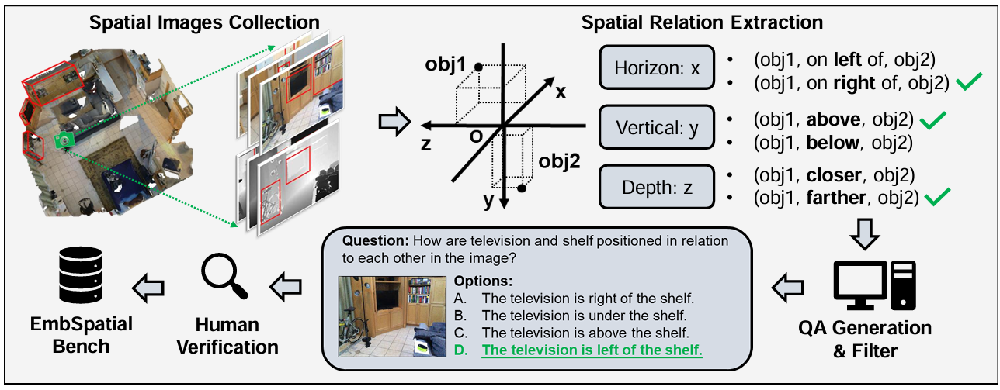
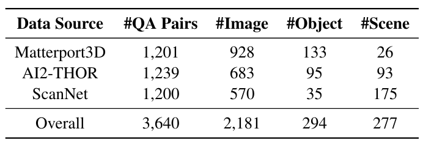
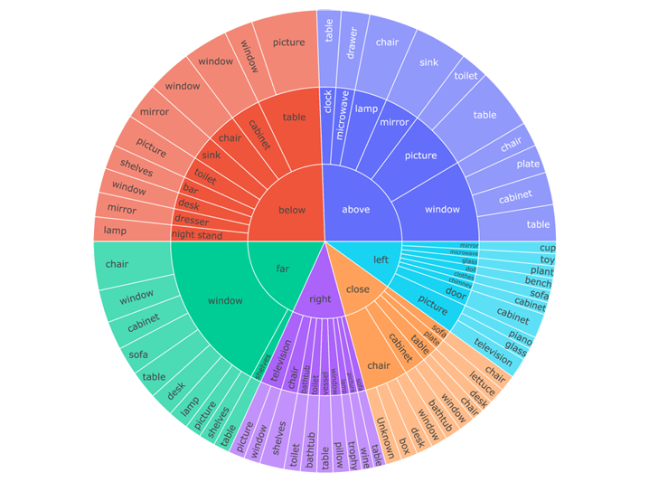

## Introduction



EmbSpatial-Bench, a dedicated evaluation benchmark for embodied artificial intelligence, is proposed to systematically assess the spatial understanding capabilities of large vision-language models (LVLMs) in embodied environments. The benchmark focuses on six fundamental egocentric spatial relationships—left, right, above, below, close, and far—covering horizontal, vertical, and depth dimensions that are critical for embodied perception and interaction. EmbSpatial-Bench is constructed from three heterogeneous embodied 3D datasets, including Matterport3D, AI2-THOR, and ScanNet, spanning both simulated and real-world indoor scenarios. It comprises 3,640 carefully curated multiple-choice question–answer pairs, covering 294 object categories across 277 scenes. By automatically extracting spatial relations from well-annotated 3D environments and applying rigorous filtering and human verification, EmbSpatial-Bench ensures high reliability, balanced relation distribution, and strong alignment with real embodied task settings.

## Benchmark characteristics

- **Focused Spatial Capability Evaluation**: It is specifically designed to evaluate embodied spatial understanding from an egocentric perspective, covering six fundamental spatial relations—left, right, above, below, close, and far—across horizontal, vertical, and depth dimensions.

- **Embodied-Scenario-Aligned Data**: It is constructed from three heterogeneous embodied 3D datasets, including Matterport3D, AI2-THOR, and ScanNet, spanning both simulated and real-world indoor environments to ensure strong consistency with real embodied task settings.

- **High-Quality and Balanced Annotations**: It contains 3,640 carefully curated multiple-choice question–answer pairs covering 294 object categories across 277 scenes, with balanced spatial relation distributions achieved through automated construction, rigorous filtering, and human verification.

- **Standardized Evaluation Format**: It adopts a unified multiple-choice question format, enabling fair and reproducible evaluation of large vision-language models under both generation-based and likelihood-based evaluation protocols.

- **Extensible Training Support**: In addition to the benchmark, it provides an accompanying instruction-tuning dataset (EmbSpatial-SFT) to facilitate targeted enhancement of embodied spatial understanding capabilities in vision-language models.

## Data Statistics




EmbSpatial-Bench consists of 3,640 multiple-choice question–answer pairs built from 2,181 images across 277 embodied indoor scenes, covering 294 object categories. The data are sourced from three heterogeneous 3D embodied datasets—Matterport3D, AI2-THOR, and ScanNet—and uniformly span six egocentric spatial relations (left, right, above, below, close, and far), ensuring balanced distribution and strong alignment with real-world embodied environments.

## Evaluation

This paper proposes a benchmark-based evaluation protocol to assess the embodied spatial understanding of large vision-language models.

- **Evaluation setting**: The benchmark evaluates models in a zero-shot setting, without any task-specific fine-tuning, to measure their inherent spatial understanding capability in embodied environments.

- **Evaluation format**: All evaluations are conducted using a multiple-choice question–answer format, focusing on six egocentric spatial relations (left, right, above, below, close, and far) derived from embodied 3D scenes.

- **Evaluation strategy**: Two evaluation strategies are employed: a generation-based strategy, which extracts the predicted option from the model’s textual output, and a likelihood-based strategy, which selects the option with the highest conditional probability given the image and question, reducing the impact of insufficient instruction-following ability.

- **Evaluation metric**: Accuracy is used as the primary metric to report model performance, enabling consistent comparison across different vision-language models.

## Citation

```
@inproceedings{du2024embspatial,
  title={Embspatial-bench: Benchmarking spatial understanding for embodied tasks with large vision-language models},
  author={Du, Mengfei and Wu, Binhao and Li, Zejun and Huang, Xuan-Jing and Wei, Zhongyu},
  booktitle={Proceedings of the 62nd Annual Meeting of the Association for Computational Linguistics (Volume 2: Short Papers)},
  pages={346--355},
  year={2024}
}

```
