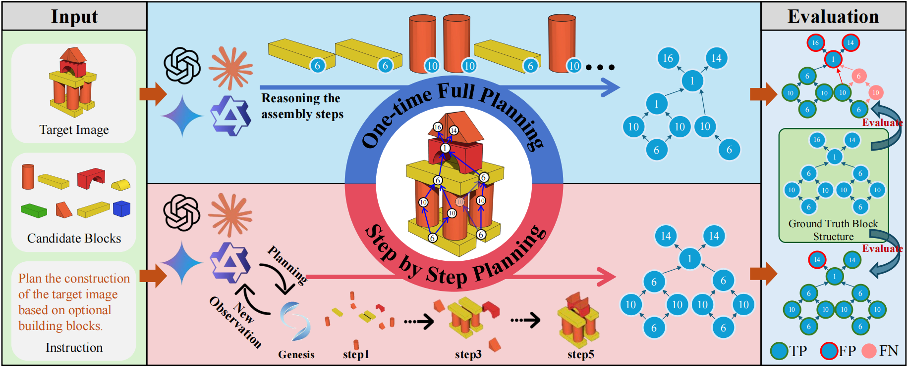
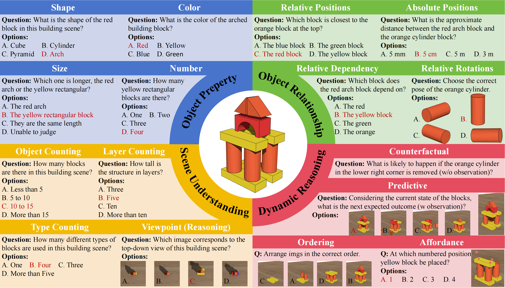

## Introduction




PhyBlock, a progressive benchmark designed to assess VLMs on physical understanding and planning through robotic 3D block assembly tasks. PhyBlock integrates a novel four-level cognitive hierarchy assembly task alongside targeted Visual Question Answering (VQA) samples, collectively aimed at evaluating progressive spatial reasoning and fundamental physical comprehension, including object properties, spatial relationships, and holistic scene understanding. PhyBlock includes 2600 block tasks (400 assembly tasks, 2200 VQA tasks) and evaluates models across three key dimensions: partial completion, failure diagnosis, and planning robustness.

# Benchmark Characteristics


## Data Statistics

The first branch, Hierarchical Assembly Planning, evaluates model’s capacity to plan and reason about spatial arrangements through step-by-step interactions in a physics-aware simulator.  This planning branch features 400 systematically constructed scenes across four ascending difficulty tiers (Basic, Simple Combinations, Complex Structures, and Advanced Spatial Planning), culminating in assemblies that involve up to 22 distinct blocks.

The second branch, Physical-Understanding VQA, measures model’s explicit understanding of physical concepts.
The VQA branch comprises 2,200 rigorously curated questions spanning 16 semantic categories including object attributes, relational reasoning, scene dynamics, and counterfactual inference.

## Evaluation

### Evaluation of Vision-Based Block Construction Task
Given an initial scene (RGB-D scans), a goal image, and a textual instruction, the model generates a complete block assembly plan in a single forward pass—without iterative feedback or action history. This tests the model’s global planning ability.


### Evaluation of Physical Understanding VQA Task
The model is queried with simple natural language questions based on block scene images from the Physics Understanding VQA dataset. Prompts target the question, testing the model’s intuitive physical reasoning via direct visual grounding.

### Evaluation Metrics
This paper evaluates performance using precision, recall, and F₁-score, based on step-wise correctness defined by the AOV constraints:
- correct steps as True Positives (TP)
- incorrect as False Positives (FP)
- missing required steps as False Negatives (FN)

Micro-F1 is computed across all samples and difficulty levels for overall performance.

In addition, to evaluate the agent’s physical perception and reasoning capabilities, this work adopts a simple yet effective metric for the Physics Understanding VQA dataset. Since each question follows a multiple-choice format, it reports the accuracy—the proportion of correctly answered questions—as the primary evaluation metric.

## Citation

```
@article{ma2025phyblockprogressivebenchmarkphysical,
  title={PhyBlock: A Progressive Benchmark for Physical Understanding and Planning via 3D Block Assembly},
  author={Liang Ma and Jiajun Wen and Min Lin and Rongtao Xu and Xiwen Liang and Bingqian Lin and Jun Ma and Yongxin Wang and Ziming Wei and Haokun Lin and Mingfei Han and Meng Cao and Bokui Chen and Ivan Laptev and Xiaodan Liang},
  journal={arXiv preprint arXiv:2506.08708},
  year={2025}
}
```
