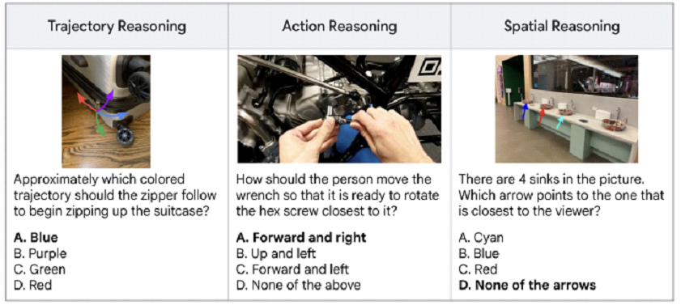
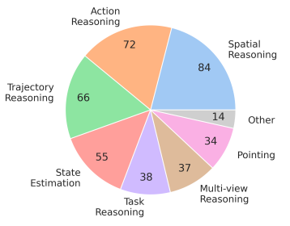

## Benchmark Introduction



To advance embodied reasoning in Vision-Language Models (VLMs), ERQA (Embodied Reasoning Question Answering) is introduced as a benchmark specifically targeting capabilities essential for agents interacting with the physical world. ERQA includes 400 multiple-choice Visual Question Answering (VQA)-style questions spanning a diverse set of categories, such as spatial reasoning, trajectory reasoning, action reasoning, state estimation, pointing, multi-view reasoning, and task reasoning. Unlike existing VLM benchmarks that primarily focus on atomic skills like object recognition, counting, or localization, ERQA emphasizes higher-level reasoning skills critical for physical interaction, making it a complementary addition to current evaluation suites.

## Benchmark Characteristics

- **Complementary Nature**: ERQA is complementary to existing VLM benchmarks that often focus on more atomic visual understanding tasks.
- **Open-Source**: The benchmark is open-source and its details can be found on GitHub.
- **Manual Labeling**: All questions in ERQA were manually labeled to ensure correctness and quality.

## Benchmark Statistics

- **Total Questions**: 400 multiple-choice VQA-style questions.
- **Image Sources**: Images in the benchmark are either self-taken or sourced from various datasets including OXE, UMI Data, MECCANO, HoloAssist, and EGTEA Gaze+.



## Benchmark Evaluation

ERQA also provide an example of a lightweight evaluation harness for querying multimodal APIs (Gemini 2.0 and OpenAI) with examples loaded from the ERQA benchmark.

## Citation
```
@misc{geminiroboticsteam2025geminiroboticsbringingai,
      title={Gemini Robotics: Bringing AI into the Physical World},
      author={Gemini Robotics Team and Saminda Abeyruwan and Joshua Ainslie and Jean-Baptiste Alayrac and Montserrat Gonzalez Arenas and Travis Armstrong and Ashwin Balakrishna and Robert Baruch and Maria Bauza and Michiel Blokzijl and Steven Bohez and Konstantinos Bousmalis and Anthony Brohan and Thomas Buschmann and Arunkumar Byravan and Serkan Cabi and Ken Caluwaerts and Federico Casarini and Oscar Chang and Jose Enrique Chen and Xi Chen and Hao-Tien Lewis Chiang and Krzysztof Choromanski and David D'Ambrosio and Sudeep Dasari and Todor Davchev and Coline Devin and Norman Di Palo and Tianli Ding and Adil Dostmohamed and Danny Driess and Yilun Du and Debidatta Dwibedi and Michael Elabd and Claudio Fantacci and Cody Fong and Erik Frey and Chuyuan Fu and Marissa Giustina and Keerthana Gopalakrishnan and Laura Graesser and Leonard Hasenclever and Nicolas Heess and Brandon Hernaez and Alexander Herzog and R. Alex Hofer and Jan Humplik and Atil Iscen and Mithun George Jacob and Deepali Jain and Ryan Julian and Dmitry Kalashnikov and M. Emre Karagozler and Stefani Karp and Chase Kew and Jerad Kirkland and Sean Kirmani and Yuheng Kuang and Thomas Lampe and Antoine Laurens and Isabel Leal and Alex X. Lee and Tsang-Wei Edward Lee and Jacky Liang and Yixin Lin and Sharath Maddineni and Anirudha Majumdar and Assaf Hurwitz Michaely and Robert Moreno and Michael Neunert and Francesco Nori and Carolina Parada and Emilio Parisotto and Peter Pastor and Acorn Pooley and Kanishka Rao and Krista Reymann and Dorsa Sadigh and Stefano Saliceti and Pannag Sanketi and Pierre Sermanet and Dhruv Shah and Mohit Sharma and Kathryn Shea and Charles Shu and Vikas Sindhwani and Sumeet Singh and Radu Soricut and Jost Tobias Springenberg and Rachel Sterneck and Razvan Surdulescu and Jie Tan and Jonathan Tompson and Vincent Vanhoucke and Jake Varley and Grace Vesom and Giulia Vezzani and Oriol Vinyals and Ayzaan Wahid and Stefan Welker and Paul Wohlhart and Fei Xia and Ted Xiao and Annie Xie and Jinyu Xie and Peng Xu and Sichun Xu and Ying Xu and Zhuo Xu and Yuxiang Yang and Rui Yao and Sergey Yaroshenko and Wenhao Yu and Wentao Yuan and Jingwei Zhang and Tingnan Zhang and Allan Zhou and Yuxiang Zhou},
      year={2025},
      eprint={2503.20020},
      archivePrefix={arXiv},
      primaryClass={cs.RO},
      url={https://arxiv.org/abs/2503.20020},
}
}
```
