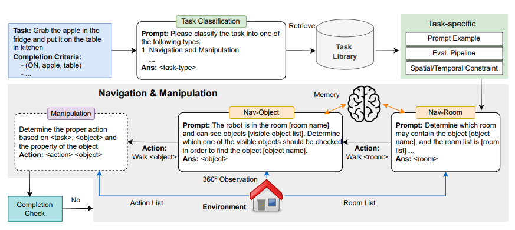

## Introduction


The ET-Plan-Bench focuses on various aspects of spatial understanding, including relation constraints, object occlusion, and global layout maps, as well as temporal understanding, covering action dependencies and optimal moving paths for robots. It provides a detailed and thorough diagnostic assessment of existing foundation models.

## Data Statistics


## Evaluation

- ET-Plan-Bench uses an LLM agent baseline for automatic quantitative evaluation. The LLM agent pipeline for evaluation comprises an automatic prompt selection module, a navigation module, and a manipulation module.
- ET-Plan-Bench uses five evaluation metrics to evaluate the performance on proposed embodied tasks, including success rate, action sequence length, longest common subsequence (LCS) length, LCS ratio with the ground truth action sequence, and moving distance for executing the tasks.



## Citation

```
@article{zhang2025etplanbenchembodiedtasklevelplanning,
  title={ET-Plan-Bench: Embodied Task-level Planning Benchmark Towards Spatial-Temporal Cognition with Foundation Models},
  author={Lingfeng Zhang and Yuening Wang and Hongjian Gu and Atia Hamidizadeh and Zhanguang Zhang and Yuecheng Liu and Yutong Wang and David Gamaliel Arcos Bravo and Junyi Dong and Shunbo Zhou and Tongtong Cao and Xingyue Quan and Yuzheng Zhuang and Yingxue Zhang and Jianye Hao},
  journal={arXiv preprint arXiv:2410.14682},
  year={2024}
}
```
