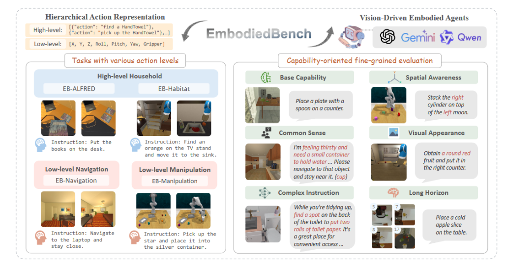

## Introduction



EB-Navigation is the navigation-focused benchmark within EmbodiedBench, designed to evaluate the low-level perception, grounding, and action prediction capabilities of Multimodal Large Language Models (MLLMs). It is built on AI2-THOR environments with tasks derived from the VLN-CE (Vision-and-Language Navigation in Continuous Environments) protocol, but restructured to use step-wise high-level commands.

Each task gives the agent:
1. An initial location in a 3D room
2. An instruction in natural language (e.g., "go to the microwave")
3. Egocentric RGB image observations
4. A set of possible movement actions (e.g., move forward, turn left, turn right, stop)

The agent must reach the correct goal location within a limited number of steps by interpreting visual scenes and language.
## Benchmark characteristics
EB-Navigation focuses on short-horizon, visually grounded action prediction. Key characteristics include:

- **Low-Level Control**: The agent directly selects motion actions such as moving and turning, unlike symbolic planning in EB-ALFRED.

- **Fine-Grained Visual Perception**: Success depends on accurate visual recognition, spatial reasoning, and continuous localization.

- **Natural Language Commands**: Tasks are grounded in simple, goal-directed instructions like "go to the sink" or "move to the red couch".

- **Strict Success Criteria**: The agent must stop within a fixed spatial radius (1.0m) of the goal to be marked successful.

- **Hard Negative Sampling**: Distractor objects of the same type are intentionally placed to test precise object localization.

- **Limited Step Budget**: Agents are allowed a maximum of 10–15 environment steps per episode.


## Data Statistics
300 tasks sampled from VLN-CE room layouts using AI2-THOR.

- **Instruction types**: navigation to furniture, appliances, and containers (e.g., sofa, microwave, cabinet).

- **Action space**: 4 discrete actions — move forward, turn left, turn right, stop.

- **Observation**: Egocentric RGB images (no depth or segmentation).

- **Success radius**: 1.0 meter.

- **Step limit**: 10–15 steps per episode depending on difficulty.
## Evaluation
EB-Navigation was used to evaluate the same set of 24 MLLMs (8 proprietary + 16 open-source) under identical conditions (image resolution = 500×500, temperature = 0, greedy decoding).

### Highlights:

- GPT-4o achieved the best performance with over 80% success rate.

- Claude-3.7-Sonnet also performed strongly with ~78%.

- Open-source models trailed significantly, with top OSS model InternVL3-78B around 55% success.

- Vision-only ablations showed significant performance drops, indicating strong reliance on visual input.

### Insights:

- Unlike EB-ALFRED, performance here depends heavily on fine-grained visual grounding.

- Most failure cases are due to visual misidentification or orientation errors, not reasoning or planning.

- Models that perform well here tend to have better vision encoders and object localization capacity.

## Citation

```
@article{yang2025embodiedbench,
  title={EmbodiedBench: Comprehensive Benchmarking Multi-modal Large Language Models for Vision-Driven Embodied Agents},
  author={Yang, Rui and Chen, Hanyang and Zhang, Junyu and Zhao, Mark and Qian, Cheng and Wang, Kangrui and Wang, Qineng and Koripella, Teja Venkat and Movahedi, Marziyeh and Li, Manling and others},
  journal={arXiv preprint arXiv:2502.09560},
  year={2025}
}

```
