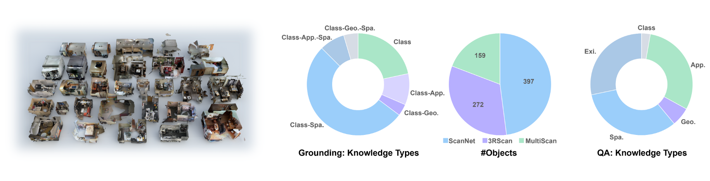

## Introduction


Beacon3D-QA(3D) is a novel benchmark for 3D grounding and question answering (QA) tasks. Beacon3D features an object-centric evaluation framework, with Grounding Chains (G-Chains) and Grounding-QA Chains (GQA-Chains) for each object. Beacon3D comprises 800+ objects across ScanNet, 3RScan, and MultiScan. The evaluation adopts object-centric metrics to ensure robustness and utilizes chain analysis for studies in task coherence. We also design various knowledge types such as class, appearance ("App."), geometry ("Geo."), spatial ("Spa."), and existence ("Exi.").

## Benchmark Characteristics

\- **High-quality test data.** We establish detailed annotation guidelines, ensuring precise and natural language to address prior data flaws. The human study across different 3D-VL benchmarks highlights the quality of Beacon3D test data.

-**Object-centric evaluation metrics.** In contrast to previous per-case average metrics, we design three diverse test cases per object and adopt object-centric metrics, which require the model to make correct predictions in all three cases.

-**Grounding-QA Chain.** Beacon3D links QA data to grounding data via shared referential texts of the target object. Each question queries a specific aspect (_e.g._, appearance) of the object, forming a Grounding-QA Chain that enables analysis of grounding-QA coherence.

## Data Statistics

\- **Data Source.** Beacon3D is built on 30 high-quality real 3D scenes meticulously selected from ScanNet, 3RScan, and MultiScan. The object-centric evaluation includes more than 800 objects (2500+ data instances per task) and shows a diverse distribution of knowledge types in grounding and QA tasks.



## Evaluation

Beacon3D evaluates performance using two metrics: (1) case-centric metrics, which align with conventional metrics that measure performance per test data instance; and (2) object-centric metrics, which are more strict by requiring the model to make consistently correct predictions per object. Additionally, for unified models that can simultaneously perform grounding and QA tasks, we have detailed metrics for task coherence analysis. See GitHub repo for more information.

## Citation

```
@inproceedings{huang2025unveiling,
  title={Unveiling the Mist over 3D Vision-Language Understanding: Object-centric Evaluation with Chain-of-Analysis},
  author={Huang, Jiangyong and Jia, Baoxiong and Wang, Yan and Zhu, Ziyu and Linghu, Xiongkun and Li, Qing and Zhu, Song-Chun and Huang, Siyuan},
  booktitle={Proceedings of the IEEE/CVF Conference on Computer Vision and Pattern Recognition (CVPR)},
  year={2025}
}
```
