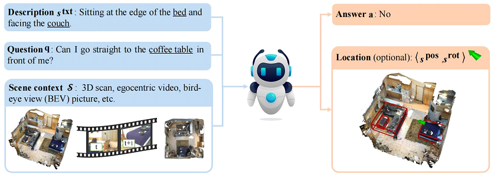
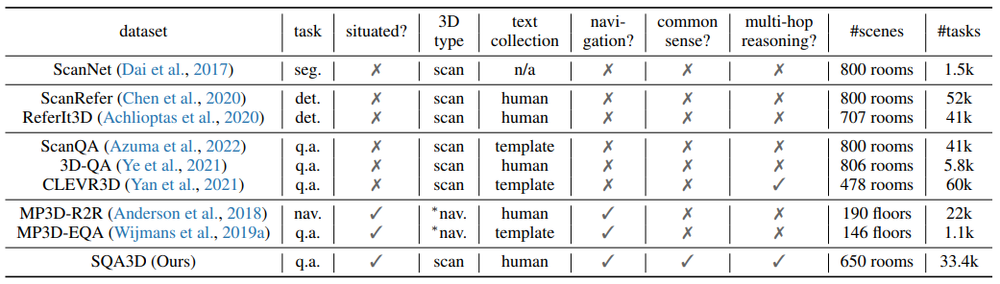
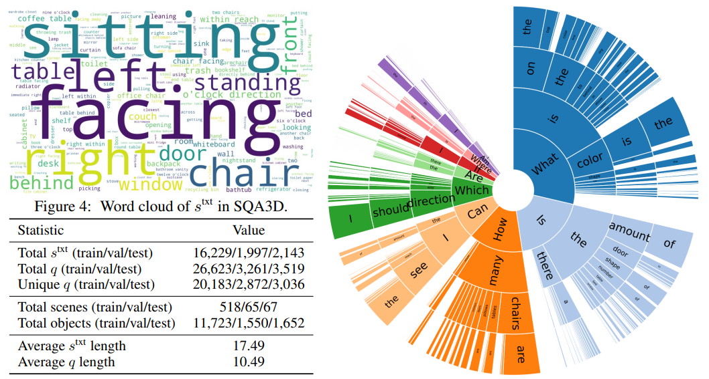

## Benchmark Introduction



This work introduces a new benchmark for embodied scene understanding, aimed at bridging the gap between 3D scene comprehension and embodied AI. In the SQA3D task, the tested agent is required to first understand its situation (e.g., position, orientation, etc.) in a 3D scene, as described by text. It then needs to reason about the surrounding environment and answer a question based on that situation. The benchmark is built upon 650 scenes from the ScanNet dataset, offering a dataset centered around 6.8k unique situations. This dataset includes 20.4k descriptions and 33.4k diverse reasoning questions designed for these situations. The questions test a wide range of reasoning capabilities for intelligent agents, from spatial relation understanding to commonsense reasoning, navigation, and multi-hop reasoning.

## Benchmark Characteristics

- **Purpose**: To quantitatively evaluate the visual-spatial intelligence of Multimodal Large Language Models (MLLMs) and assess their embodied reasoning capabilities.
- **Reasoning Focus**: Requires models to register objects across multiple frames and reason about object affordances and 3D relationships within a scene.
- **Data Collection**: Questions are manually labeled to ensure quality and correctness. Images are either self-taken or sourced from various robotics datasets like OXE, UMI Data, MECCANO, HoloAssist, and EGTEA Gaze+.
- **Complementary Nature**: Designed to complement existing VLM benchmarks that often focus on more atomic visual understanding tasks.



## Benchmark Statistics

- **Total Questions**: 400 multiple-choice questions.
- **Multi-Image Questions**: 28% of questions include more than one image, posing a greater challenge.




## Benchmark Evaluation

SQA3D presents a significant challenge to current multi-modal, especially 3D reasoning models. Various state-of-the-art approaches were evaluated, with the best-performing model achieving only an overall score of 47.20%. In contrast, amateur human participants reached an impressive score of 90.06%.

## Citation
```
@inproceedings{ma2022sqa3d,
    title={SQA3D: Situated Question Answering in 3D Scenes},
    author={Ma, Xiaojian and Yong, Silong and Zheng, Zilong and Li, Qing and Liang, Yitao and Zhu, Song-Chun and Huang, Siyuan},
    booktitle={International Conference on Learning Representations},
    year={2023},
    url={https://openreview.net/forum?id=IDJx97BC38}


```
