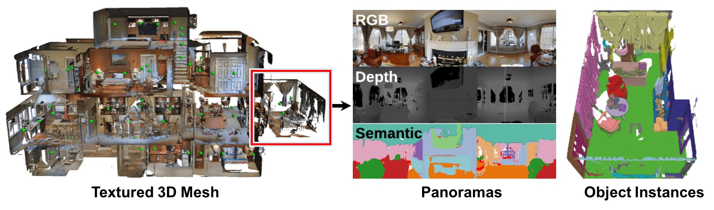

## Introduction



The Matterport3D (MP3D) dataset provides high-fidelity, photorealistic scans of real-world indoor environments. It contains a diverse set of 90+ buildings including homes, offices, and churches. The ObjectNav benchmark on MP3D evaluates an agent’s ability to generalize object search strategies across these complex layouts, with limited prior information about the target’s location. MP3D presents challenges such as long-range navigation, occlusions, and diverse room layouts. Agents are tested in unseen environments to assess their generalization capabilities, with metrics like Success Rate (SR) and Success weighted by Path Length (SPL).

## Benchmark Characteristics

### Dataset Scale and Scene Diversity

**Coverage**
Contains 10,800 indoor scenes across 9 building categories, including:

- Apartments, offices, hotels, stores

Each scene includes an average of 5–6 rooms, enabling testing of:

- Cross-room navigation
- Multi-object search
- Long-horizon embodied tasks

**Real-World Acquisition**
Captured using the Matterport Pro camera system.
Scenes are sourced from real commercial and residential environments, preserving:

- Natural furniture layouts
- Lighting conditions
- Texture details (e.g., wall materials, floor patterns)

### Data Formats and Core Content

**Multimodal Data**

- 3D Mesh Models: Textured triangular mesh surfaces, usable for rendering and physics simulation
- Panoramic RGB-D Images: ~200 per scene, each 360° with RGB and cm-level depth precision
- Point Clouds: Provide geometric coordinates with color, supporting classification and segmentation tasks

**Semantic Annotations**

- Pixel-level segmentation for 80 object categories (e.g., sofas, tables, bookshelves)
- Room type labels (e.g., bedroom, kitchen)

**Topological Structure**

- Annotated room connectivity (e.g., doorways, hallway links)
- Supports graph-based path planning and scene reasoning

### Task Support and Applications

**Visual Navigation**

- Goal-driven navigation: "Navigate to the living room TV"
- Mapless exploration and localization (for SLAM validation)
- Obstacle avoidance and path optimization in cluttered environments

**3D Scene Understanding**

- Object detection and segmentation (3D bounding box prediction)
- Scene layout reconstruction (e.g., room structure, furniture arrangement)
- Cr

## Evaluation

SR (Success Rate): The proportion of episodes in which the agent successfully reaches the target object. A task is considered successful if the agent issues a “stop” action and the distance between the agent and the target object is less than 1 meter.

## Citation

```
@article{Matterport3D,
    title={Matterport3D: Learning from RGB-D Data in Indoor Environments},
    author={Chang, Angel and Dai, Angela and Funkhouser, Thomas and Halber, Maciej and Niessner, Matthias and Savva, Manolis and Song, Shuran and Zeng, Andy and Zhang, Yinda},
    journal={International Conference on 3D Vision (3DV)},
    year={2017}
}
```
