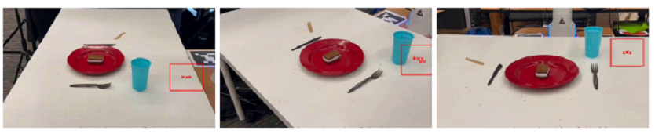

## Introduction



Where2Place is a benchmark for spatial free-space reference on challenging real world images This dataset contains 100 real-world images to evaluate free space reference using spatial relations. The images are collected from various cluttered environments. Each image is labeled with a sentence describing the desired some free space and a mask of the desired region.
## Benchmark Characteristics

- Manually annotated, challenging real-world benchmark.
- Features diverse and cluttered scenes.
- Includes relation types not present in the synthetic training data (for a subset of 30 examples, WHERE2PLACE (h)).

## Data Statistics:

- Consists of 100 real-world images from homes and offices.

## Evaluation

The Spatial Reference Accuracy (SRA) metric evaluates the precision of predicted spatial points (from text like JSON coordinates or tuples) against a ground truth mask (binary or bounding box). It parses predictions into pixel coordinates, checks their validity within image dimensions, and computes accuracy as the ratio of points within the mask to total valid points. Returns 0 for empty predictions or processing errors, suitable for object localization and region-based tasks but sensitive to coordinate scaling.

## Citation

```
@article{yuan2024robopoint,
  title={RoboPoint: A Vision-Language Model for Spatial Affordance Prediction for Robotics},
  author={Yuan, Wentao and Duan, Jiafei and Blukis, Valts and Pumacay, Wilbert and Krishna, Ranjay and Murali, Adithyavairavan and Mousavian, Arsalan and Fox, Dieter},
  journal={arXiv preprint arXiv:2406.10721},
  year={2024}
}

```
