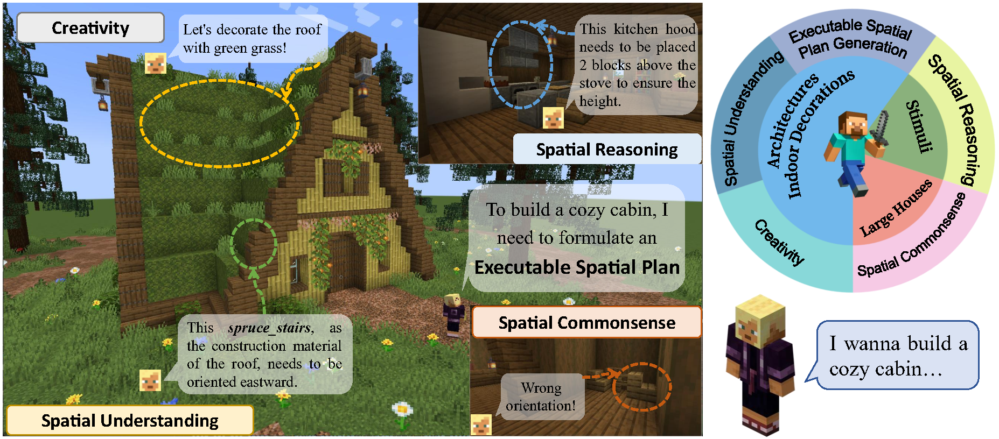
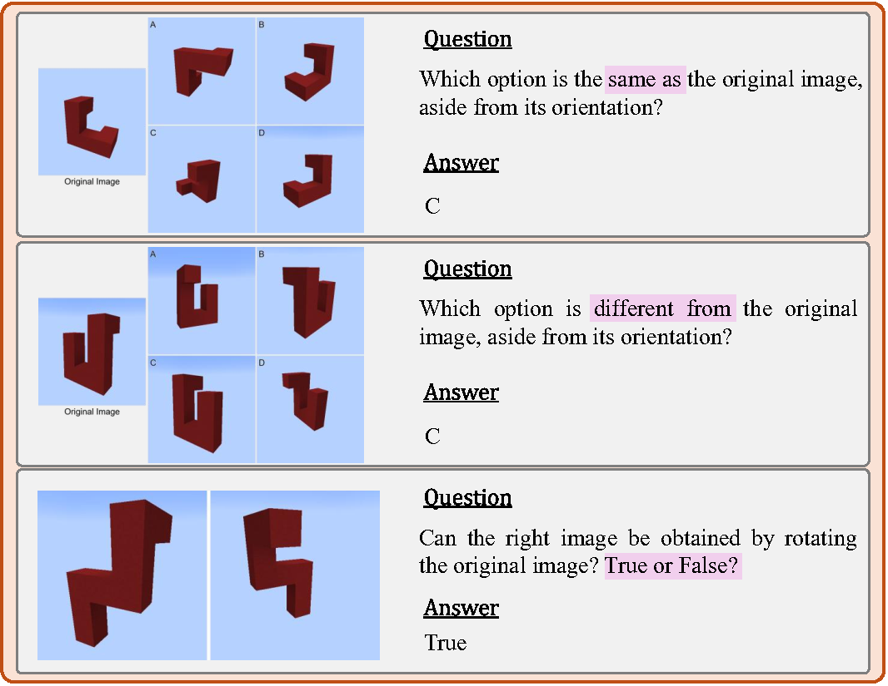
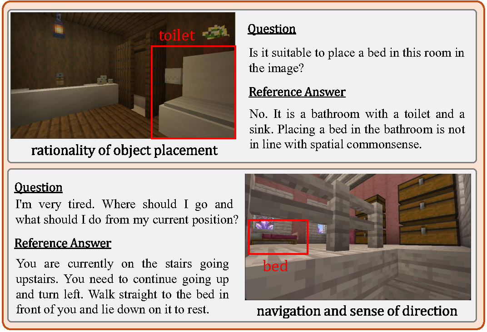

## Benchmark Introduction



Spatial Planning is a crucial part in the field of spatial intelligence, which requires the understanding and planning about object arrangements in space perspective. AI agents with the spatial planning ability can better adapt to various real-world applications, including robotic manipulation, automatic assembly, urban planning etc. Recent works have attempted to construct benchmarks for evaluating the spatial intelligence of Multimodal Large Language Models (MLLMs). Nevertheless, these benchmarks primarily focus on spatial reasoning based on typical Visual Question-Answering (VQA) forms, which suffers from the gap between abstract spatial understanding and concrete task execution. In this work, we take a step further to build a comprehensive benchmark called MineAnyBuild, aiming to evaluate the spatial planning ability of open-world AI agents in the Minecraft game. Specifically, MineAnyBuild requires an agent to generate executable architecture building plans based on the given multi-modal human instructions. It involves 4,000 curated spatial planning tasks and also provides a paradigm for infinitely expandable data collection by utilizing rich player-generated content. MineAnyBuild evaluates spatial planning through four core supporting dimensions: spatial understanding, spatial reasoning, creativity, and spatial commonsense. Based on MineAnyBuild, we perform a comprehensive evaluation for existing MLLM-based agents, revealing the severe limitations but enormous potential in their spatial planning abilities. We believe our MineAnyBuild will open new avenues for the evaluation of spatial intelligence and help promote further development for open-world AI agents capable of spatial planning.


## Benchmark Evaluation
Our MineAnyBuild involves approximately 4,000 spatial planning tasks with 500+ buildings/indoor decoration assets. These tasks, including Executable Spatial Plan Generation, Spatial Understanding, Creativity, Spatial Reasoning, and Spatial Commonsense, correspond to diverse evaluation dimensions, thereby conducting a comprehensive assessment of AI agents’ spatial planning capabilities. In Executable Spatial Plan Generation, Spatial Understanding, and Creativity tasks, the agent needs to generate executable spatial plans for building an architecture according to the given instruction. While in Spatial Reasoning and Spatial Commonsense tasks, we introduce ~2,000 VQA pairs, where we ask the agent to answer the given questions accompanied by the related images.

### Spatial Reasoning VQA Task
There are three main types of our Spatial Reasoning tasks in total, where selecting the same one from four stimuli, selecting the different one from four stimuli, and judging whether two stimuli can be obtained only by rotation.
<div align="center">
  
</div>

### Spatial Commonsense VQA Task
Spatial Commonsense refers to humans’ intuitive understanding of spatial attributes such as the position, direction, distance, and shape of objects in the physical world, and it appears in every aspect of daily life. We list the most important types of spatial commonsense in our task data and provide explanations as follows:

- **Rationality of object placement**: To estimate a contradiction between asset function and space and whether the size of an item is suitable for a certain space (e.g., *“a refrigerator should not be placed in the bathroom”*).
- **Navigation and sense of direction**: We require agents to locate directions without previous information, and determine abnormal situations (e.g., *“you need to turn right when going upstairs” and “the chair can not be under the table”*).
- **Path planning**: We require agents to avoid obstacles and bypass them rather than attempting to pass through a wall when conducting path planning.
- **Proximity commonsense**: We require agents to make judgments based on spatial commonsense and intuition rather than precise measurement, just as humans judge distance.
- **Furniture placement**: For some common combinations of spatial object relationships, such as the orientation and position of table and chair arrangements, we request agents to make correct judgments.
- **Spatial inclusion relationship**: If object A is completely inside container B, then the volume of A must be smaller than the internal space of B (e.g., *“a piano cannot fit into a chest”*).
- **Transitivity of topological relations**: If A is to the left of B and B is to the left of C, then A is usually to the left of C. However, agents need to make judgments and verifications based on actual visual observations. Humans can determine this transitivity without logical training, and we evaluate whether the agents can achieve it.
<div align="center">
  
</div>

## Citation

```
@article{wei2025mineanybuild,
  title={MineAnyBuild: Benchmarking Spatial Planning for Open-world AI Agents},
  author={Wei, Ziming and Lin, Bingqian and Jiao, Zijian and Nie, Yunshuang and Ma, Liang and Liu, Yuecheng and Zhuang, Yuzheng and Liang, Xiaodan},
  journal={arXiv preprint arXiv:2505.20148},
  year={2025}
}
```
