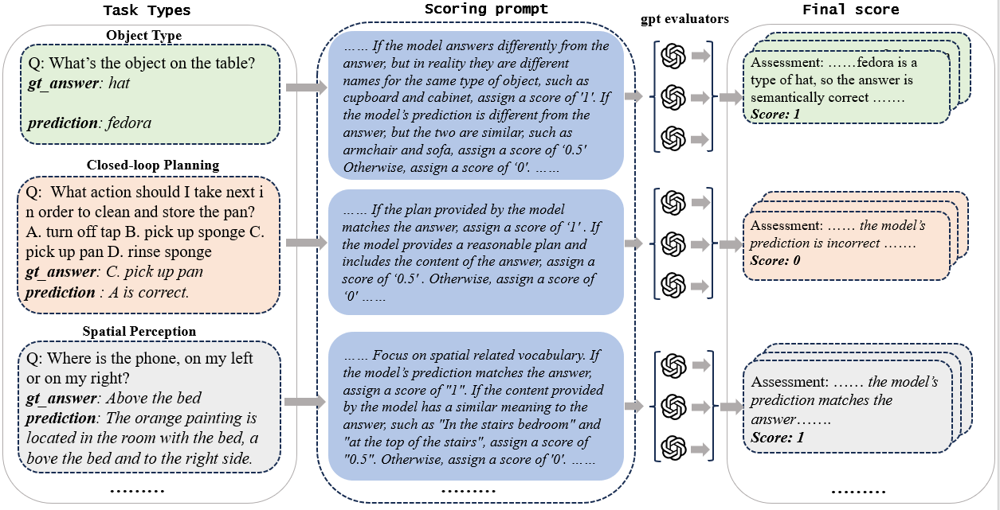

## Benchmark Introduction


In this work, we propose UniEQA, a new unified evaluation benchmark for EAI, designed to evaluate MFMs in terms of 5 core capabilities with 12 detailed dimensions.

## Benchmark characteristics

- **Broad Coverage of Capabilities**: It encompasses 5 core capabilities – object understanding, spatiotemporal perception, embodied knowledge, embodied reasoning, and task planning – and achieves a hierarchical and detailed evaluation from basic cognition to advanced cognitive abilities.
- **High Data Quality**: It covers 7 data sources, including both simulation and real-world data. It integrates 5 high-quality, multi-modal evaluation datasets in the embodied AI domain and includes 1 newly annotated evaluation dataset, providing a total of over 5000 Q&A Pairs.
- **Rich Data Types**: It covers multiple data types, including single images, multiple images, videos, and text, as well as 6 types of question-answering instructions such as multiple-choice and sorting.
- **Flexible Extensibility**: It supports flexible and convenient addition of evaluation datasets.
- **Automated Evaluation**: It constructs corresponding scoring rules and a unified automated evaluation method for different capability dimensions.

## Benchmark Statistics

- Data Collection: simulation (VirtualHome, BEHAVIOR-100, AI2-THOR)

  

## Benchmark Evaluation



In this work, we propose a novel LLM-based evaluation method to improve the efficiency of the evaluation process.

- Evaluation data: we compare only two candidate answers to minimize LLM bias and try to make LLM make more objective decisions based on the semantics and logic of the candidate answers.
- Evaluation rule: we customize rule prompts for each capability dimension for more reasonable and accurate evaluation.
- Evaluation results: we use the high-performance, low-overhead GPT-4o-mini as the LLM of evaluation. To avoid accidental errors, we independently evaluate each Q&A pair three times and then take the average as the final evaluation result.

## Citation

```
@article{UniEQA2025,
  title={UniEQA & UniEval: A Unified Benchmark and Evaluation Platform fo  Multimodal Foundation Models in Embodied Question Answering},
  year={2025}
}
```
