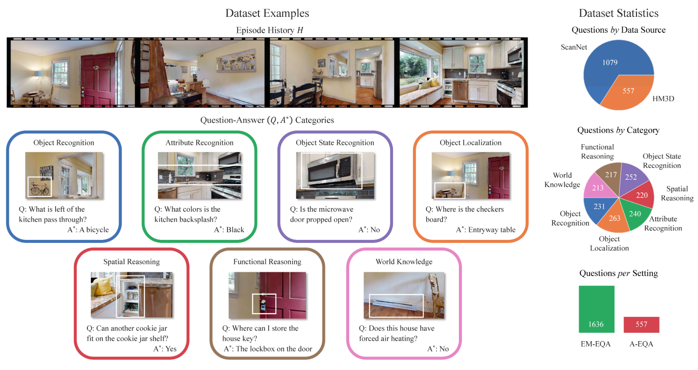
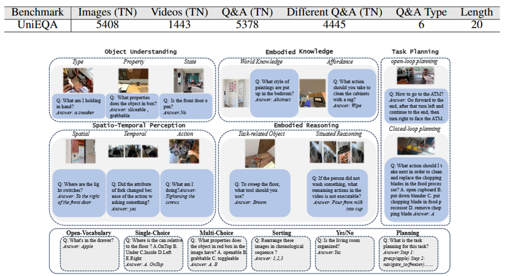

## Introduction



OpenEQA is the first open-vocabulary benchmark dataset for EQA supporting both episodic memory and active exploration use cases. OpenEQA contains over 1600 high-quality human generated questions drawn from over 180 real-world environments. OpenEQA stands out as a straightforward, measurable, and practically relevant benchmark that poses a considerable challenge to current generation of AI models.

## Data Statistics

Example questions and dataset statistics of OpenEQA. The episode history H provides a human-like tour of a home. EQA agents must answer diverse, human-generated questions Q from 7 EQA categories, aiming match the ground answers A\*. Tours are collected from diverse environments including home and office locations (not shown above). Dataset statistics (right) break down the question distribution by video source (top), question category (middle), and episodic memory vs active setting. Note that, by design, the HM3D questions are shared across the EM-EQA and A-EQA settings.

## Evaluation

Illustration of LLM-Match evaluation and workflow. While the open-vocabulary nature makes EQA realistic, it poses a challenge for evaluation due to multiplicity of correct answers. One approach to evaluation is human trials, but it can be prohibitively slow and expensive, especially for benchmarks. As an alternative, OpenEQA use an LLM to evaluate the correctness of open-vocabulary answers produced by EQA agents.



## Citation

```
@inproceedings{OpenEQA2023,
        title = {OpenEQA: Embodied Question Answering in the Era of Foundation Models},
        booktitle = {Conference on Computer Vision and Pattern Recognition (CVPR)},
        author = {Majumdar, Arjun and Ajay, Anurag and Zhang, Xiaohan and Putta, Pranav and Yenamandra, Sriram and Henaff, Mikael and Silwal, Sneha and Mcvay, Paul and Maksymets, Oleksandr and Arnaud, Sergio and Yadav, Karmesh and Li, Qiyang and Newman, Ben and Sharma, Mohit and Berges, Vincent and Zhang, Shiqi and Agrawal, Pulkit and Bisk, Yonatan and Batra, Dhruv and Kalakrishnan, Mrinal and Meier, Franziska and Paxton, Chris and Sax, Sasha and Rajeswaran, Aravind},
        year = {2024},
    }
```
