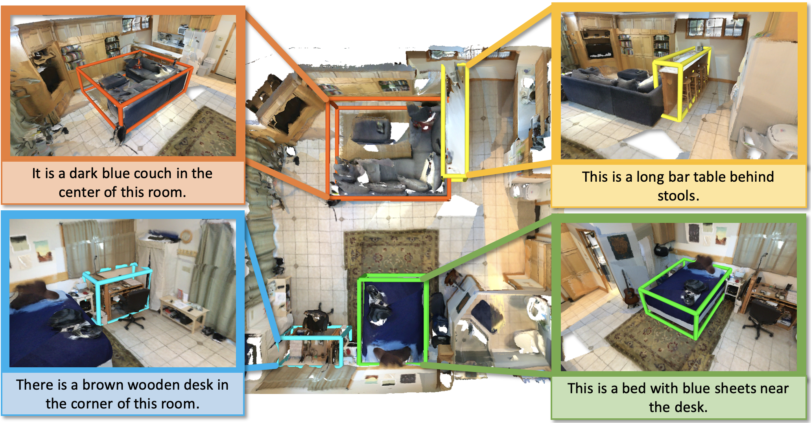

## Introduction



ScanRefer is a benchmark for 3D object localization using natural language descriptions in RGB-D scans. The task challenges models to identify and localize a target object in a 3D point cloud based solely on a free-form textual description. Unlike traditional object detection tasks, ScanRefer requires grounding language in 3D space, capturing both object semantics and spatial context. The benchmark is built on a large-scale dataset comprising 51,583 natural language expressions referring to 11,046 objects across 800 indoor scenes from ScanNet, making it the first extensive resource for studying language-driven object localization directly in 3D environments.
## Benchmark Characteristics

### Task Definition: Single-Object 3D Language Grounding

**Core Objective**
Given a 3D point cloud scene and a text description, localize the single target object referred to by the text.

**Example Scenarios**
- Attribute-based: "The red armchair in the living room"
- Spatial relation: "The coffee table in front of the sofa"
- Contextual: "The small wooden table near the window"

**Uniqueness**
Focuses on fine-grained object distinction within cluttered indoor environments.
Unlike 2D image grounding, this task leverages depth and structural context in 3D scenes.

### Dataset Construction and Annotations

**Source Data**
- Based on ScanNet (1,513 indoor scenes)
- Over 2.5 million 3D points per scene
- Covers 31 object categories, including furniture, electronics, etc.

**Annotation Scale**
- 51,583 text descriptions paired with 14,132 3D objects
- Average of 3.65 descriptions per object, promoting linguistic diversity

**Scene-Level Context**
Annotations often reference global scene layout.
Example: "The TV stand in the corner of the room"

**Linguistic Complexity**
Descriptions include:
- Attribute details (color, material, size)
- Spatial relations (e.g., positional prepositions)
- Functional descriptions (e.g., "the chair you can sit on")


## Evaluation
Acc@0.25: A prediction is considered correct if the predicted bounding box overlaps with the ground truth bounding box by more than 25% (measured by IoU - Intersection over Union).

## Citation

```
@article{chen2020scanrefer,
    title={ScanRefer: 3D Object Localization in RGB-D Scans using Natural Language},
    author={Chen, Dave Zhenyu and Chang, Angel X and Nie{\ss}ner, Matthias},
    journal={16th European Conference on Computer Vision (ECCV)},
    year={2020}
}
```
