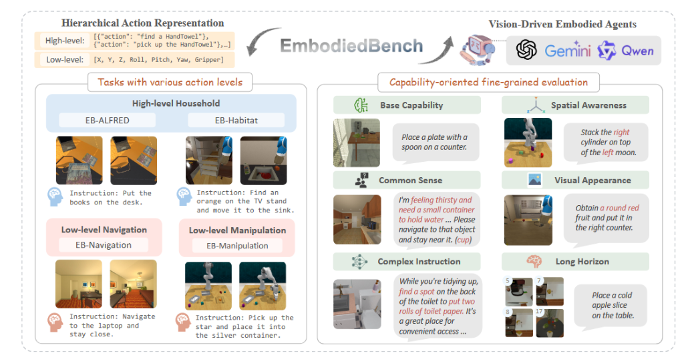

## Introduction


EB-Habitat is the 3D embodied navigation benchmark in EmbodiedBench, built on the HM3D dataset and executed in the Habitat 2.0 simulator. It evaluates an agent’s ability to perform long-horizon goal-directed navigation using only egocentric vision and natural language instructions, without access to ground-truth maps or GPS.

Each episode gives the agent:

A goal instruction (e.g., “Go to the kitchen”)

An egocentric RGB image at each timestep

Discrete movement actions (e.g., move forward, turn left, turn right, stop)

The agent must find its way to the correct semantic region in large, multi-room, real-world-like indoor environments—often requiring 10 to 50+ steps across multiple rooms and hallways.
## Benchmark characteristics
EB-Habitat is designed to test long-range visual reasoning and spatial memory. It includes the following features:

Semantic goal navigation: Tasks are defined by room types, not explicit coordinates (e.g., "find the bathroom").

High scene complexity: Environments are large and realistic, with multiple rooms, distractors, and occlusions.

Long-horizon planning: Agents often traverse 10–40 meters, which may take 50+ steps and involve multiple turns, backtracking, and disambiguation.

Egocentric-only input: No depth, map, or localization signal is provided—only raw RGB and natural language.

Habitat 2.0 realism: Uses realistic 3D layouts and textures from the HM3D dataset.

Strict success metric: The agent must issue a stop command within a semantic room of the correct type.
## Data Statistics
300 tasks, sampled from Habitat scenes in the HM3D dataset.

Goal types include common room categories: kitchen, bathroom, bedroom, living room, etc.

Environments: Large multi-room houses with realistic furniture and lighting.

Action space: move forward, turn left, turn right, stop.

Success condition: Must end in a region labeled with the correct semantic type.

Step limit: Up to 100 steps per episode.
## Evaluation
The same 24 MLLMs (8 proprietary + 16 open-source) were evaluated in EB-Habitat using a greedy, step-by-step closed-loop execution setup.

Highlights:

GPT-4o again leads, with ~45% success rate—much lower than in EB-ALFRED or EB-Navigation due to the task's difficulty.

Claude-3.7-Sonnet follows at ~41%, also struggling with long-horizon memory and spatial ambiguity.

Open-source models achieve much lower performance; most top out at 15–25% success.

Vision is absolutely necessary here—removing it drops performance to near-zero.

Insights:

The dominant failure mode is semantic confusion (e.g., stopping in the wrong room) or getting lost (e.g., looping or getting stuck).

Success correlates with the model’s ability to maintain spatial memory and recognize semantic visual cues across diverse scenes.

Unlike EB-ALFRED, language alone is insufficient; fine-grained visual understanding and spatial awareness are critical.
## Citation

```
@article{yang2025embodiedbench,
  title={EmbodiedBench: Comprehensive Benchmarking Multi-modal Large Language Models for Vision-Driven Embodied Agents},
  author={Yang, Rui and Chen, Hanyang and Zhang, Junyu and Zhao, Mark and Qian, Cheng and Wang, Kangrui and Wang, Qineng and Koripella, Teja Venkat and Movahedi, Marziyeh and Li, Manling and others},
  journal={arXiv preprint arXiv:2502.09560},
  year={2025}
}

```
