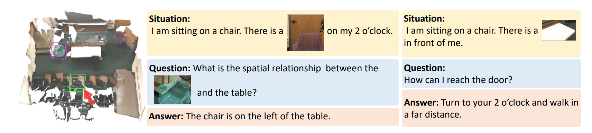
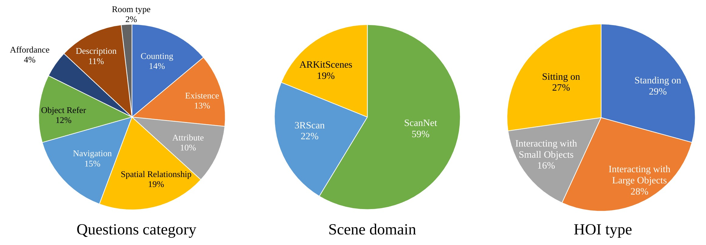

## Introduction



Multi-modal Situated Question Answering (MSQA) is a large-scale multi-modal situated reasoning dataset, scalably collected leveraging 3D scene graphs and vision-language models (VLMs) across a diverse range of real-world 3D scenes. MSQA includes 251K situated question-answering pairs across 9 distinct question categories, covering complex scenarios within 3D scenes. We introduce a novel interleaved multi-modal input setting in our benchmark to provide both texts, images, and point clouds for situation and question description, aiming to resolve ambiguity in describing situations with single-modality inputs (e.g., texts).

## Benchmark Characteristics

- **Purpose**: MSQA accepts 3D point cloud, text-image interleaved situation, location and orientation and question as multi-modal input. It comprehensively evaluates the fine-graned and layout understanding capabilities of MLLMs.
- **Quality**: The benchmark is high-quality, having undergone human review to guarantee the quality of questions and correct incorrect annotations from the source datasets.

## Data Statistics

- **Data Source**: MSQA includes 251K situated question-answering pairs across 9 distinct question categories, covering complex scenarios within 3D scenes. The dataset sources from ScanNet, 3RScan and ARKitScenes.



## Evaluation

MSQA evaluates performance using GPT-Score: we propose a robust evaluation pipeline based on LLMs (such as GPT-4o). The scoring mechanism overcomes the limitations of traditional metrics such as exact-match, and other n-gram metrics, closely aligning with human preference.

## Citation

```
@article{linghu2024multi,
  title={Multi-modal Situated Reasoning in 3D Scenes},
  author={Linghu, Xiongkun and Huang, Jiangyong and Niu, Xuesong and Ma, Xiaojian and Jia, Baoxiong and Huang, Siyuan},
  journal={Advances in Neural Information Processing Systems},
  year={2024}
}
```
