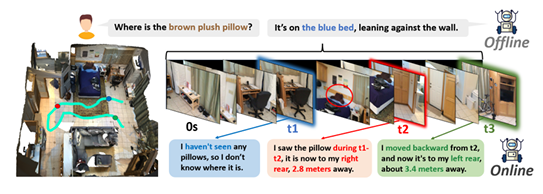
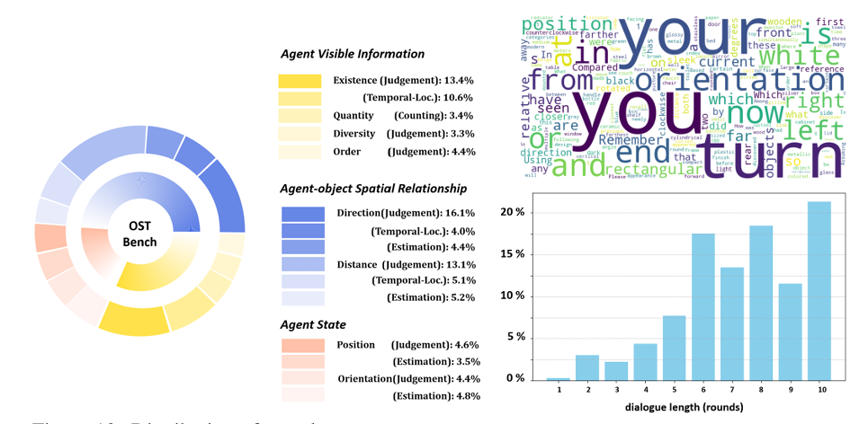

## Introduction



OST-Bench is a novel benchmark designed to evaluate the **O**nline **S**patio-**T**emporal scene understanding capabilities of Multimodal Large Language Models (MLLMs) from the perspective of an embodied agent dynamically exploring a static indoor environment. In contrast to conventional offline settings that answer questions based on a fixed set of pre-recorded inputs, OST-Bench's "Online" aspect emphasizes the need to process and reason over incrementally acquired observations. The "Spatio-Temporal" component requires integrating current visual inputs with historical memory to support dynamic spatial reasoning. Built on an efficient data collection pipeline, OST-Bench consists of 1.4k scenes and 10k question-answer pairs collected from ScanNet, Matterport3D, and ARKitScenes.


## Benchmark Characteristics

- **Online and Agent-Centric Design.** OST-Bench emphasizes the agent's need to perceive, remember, and reason over incrementally received observations, rather than complete, pre-recorded scene data. Tasks are defined from the agent's perspective, simulating real-world embodied perception.
- **Evaluation of Complex Spatio-Temporal Reasoning.** The benchmark is designed to assess an MLLM's ability to perform dynamic spatial reasoning, which requires integrating current visual observations with historical memory. It features three main task categories: Agent State, Agent Visible Info, and Agent-Object Spatial Relationship.
- **Diverse and Fine-Grained Tasks.** OST-Bench includes 15 fine-grained question subtypes that fall into four general formats: Judgment, Counting, Temporal Localization, and Estimation. This diversity provides a rigorous testbed for assessing a wide range of spatio-temporal reasoning abilities.


## Data Statistics

- **Data Source.** OST-Bench is built upon three real-world scene datasets: ScanNet, Matterport3D, and ARKitScenes, totaling 1.4k scenes and 10k question-answer pairs.
- **Task Distribution.** Questions are distributed across three main categories: **Agent State** (the agent's understanding of its own position and orientation), **Agent Visible Info** (the agent's dynamic interpretation of visible scene information), and **Agent-Object Spatial Relationships** (the agent's dynamic understanding of spatial relationships with objects).




## Evaluation

OST-Bench was used to evaluate multiple leading MLLMs (both proprietary and open-source), comparing them against a human baseline and a chance-level baseline. The evaluation reveals several key findings:

1.  There is a **substantial gap between MLLM and human performance**, with even the most advanced models lagging by nearly 30% in overall average score.
2.  Models perform poorly on tasks requiring **complex spatio-temporal reasoning** (Agent State and Agent-Object Spatial Relationship) but are more capable of dynamically perceiving scene information (Agent Visible Info).
3.  Model accuracy **declines significantly** as the agent continues to explore and the sequence of observations grows, highlighting challenges with long-term memory and reasoning over an expanding context.


## Citation

```
@article{lin2025ostbench,
  title={OST-Bench: Evaluating the Capabilities of MLLMs in Online Spatio-temporal Scene Understanding},
  author={JingLi Lin and Chenming Zhu and Runsen Xu and Xiaohan Mao and Xihui Liu and Tai Wang and Jiangmiao Pang},
  journal={arXiv preprint arXiv:2507.07984},
  year={2025}
}
```
