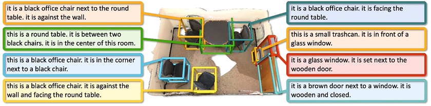

## Introduction



Scan2Cap introduces the task of dense captioning in 3D scans obtained from commodity RGB-D sensors. Given a point cloud of a 3D scene as input, the goal is to predict bounding boxes along with natural language descriptions of the underlying objects. To jointly address 3D object detection and caption generation, a method named Scan2Cap is proposed. Scan2Cap is trained in an end-to-end manner to detect objects in the input scene and generate corresponding descriptions. An attention mechanism is employed to produce descriptive tokens by attending to relevant components in the local context. To incorporate object relations—specifically relative spatial relationships—into the generated captions, a message passing graph module is introduced to facilitate the learning of relational features. The proposed approach effectively localizes and describes 3D objects in scenes from the ScanRefer dataset, achieving a significant improvement over 2D baseline methods, with a 27.61% increase in CiDEr@0.5IoU.

## Benchmark Characteristics

- **Task**: Introduces the novel task of dense captioning in 3D RGB-D scans. This involves jointly localizing and describing each object in a 3D scene.
- **Input**: Assumes a point cloud of a 3D scene, which includes geometry coordinates, RGB values, and normal vectors.
- **Output**: Expected output is bounding boxes for individual object instances along with their natural language descriptions.
- **Key Innovations**: Focuses on leveraging 3D information (like actual object size and location) for more accurate descriptions and explicitly models object relations via a graph module.

## Data Statistics

- **Dataset**: Uses the ScanRefer dataset.
  - **Number of Descriptions**: 51,583 descriptions.
  - **Number of Objects**: 11,046 objects.
  - **Number of Scenes**: 800 ScanNet scenes.

## Evaluation

| Evaluation Aspect | Details |
|---|---|
| **Primary Metrics** | **Combined Metrics ($\tilde{m^{Q}}kIoU$)**: These jointly measure the quality of generated descriptions and detected bounding boxes. They combine standard image captioning metrics (CiDEr, BLEU-4, METEOR, ROUGE) with an Intersection-over-Union (IoU) score between predicted and ground truth bounding boxes. An IoU threshold of *k* (e.g., 0.25 or 0.5) determines if a box is considered correct for the captioning score. |
| **Object Detection Metric** | **Mean Average Precision (mAP)**: Thresholded by IoU. |
| **Baselines & Comparisons** | **2D-based Captioning Methods**: Compares against approaches that operate on 2D renders of 3D scenes and then back-project to 3D (e.g., "2D-3D Proj.", "3D-2D Proj."). <br> **3D Retrieval-based Methods**: Compares against methods like "VoteNetRetr" that use features of 3D bounding boxes detected by VoteNet for description retrieval. <br> **Oracle (Ground Truth) Methods**: Evaluates upper limits of performance using ground truth (GT) object bounding boxes for description generation ("Oracle2Cap3D", "OracleRetr3D", "Oracle2Cap2D", "OracleRetr2D"). |
| **Ablation Studies** | Investigates the effectiveness of different components and training strategies: <br> - Contribution of Context-aware Attention Captioning (CAC). <br> - Contribution of the Relational Graph (RG) module. <br> - Benefits of end-to-end fine-tuning the `VoteNet` backbone with the description generation objective compared to a fixed pre-trained `VoteNet`. <br> - Impact of different point cloud features (e.g., xyz, rgb, normal, multiview). |
| **Qualitative Analysis** | Manual analysis of randomly selected descriptions generated by different methods (e.g., Oracle2Cap2D, Oracle2Cap3D, Scan2Cap) to assess accuracy of object categories, appearance attributes, and spatial relations. Visual examples are provided to compare bounding box predictions and description quality across methods. |

## Citation

```
@inproceedings{chen2021scan2cap,
  title={Scan2Cap: Context-aware Dense Captioning in RGB-D Scans},
  author={Chen, Zhenyu and Gholami, Ali and Nie{\ss}ner, Matthias and Chang, Angel X},
  booktitle={Proceedings of the IEEE/CVF Conference on Computer Vision and Pattern Recognition},
  pages={3193--3203},
  year={2021}
}

```
