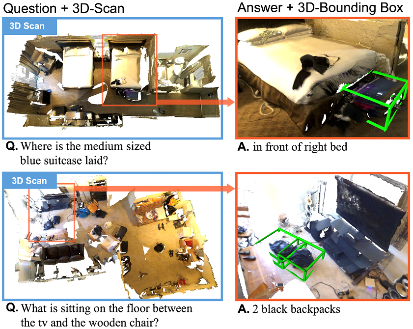
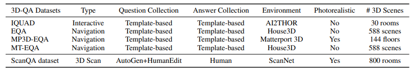
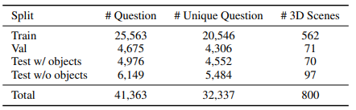

## Introduction



This work introduces a new 3D spatial understanding task for 3D question answering (3D-QA). In the 3D-QA task, models are provided with visual information from the entire 3D scene of a rich RGB-D indoor scan and are tasked with answering textual questions about the 3D scene. Unlike 2D question answering (2D-QA), conventional 2D-QA models face challenges in spatial understanding, particularly in object alignment and directions, and struggle with object localization based on textual questions in the 3D-QA context. A baseline model for 3D-QA, called ScanQA, is proposed. ScanQA learns a fused descriptor from 3D object proposals and encoded sentence embeddings. This learned descriptor correlates language expressions with the underlying geometric features of the 3D scan and enables the regression of 3D bounding boxes to identify the objects described in the textual questions. Human-edited question-answer pairs with free-form answers grounded in 3D objects from each 3D scene were collected. The new ScanQA dataset contains over 41k question-answer pairs from 800 indoor scenes derived from the ScanNet dataset.

## Benchmark Characteristics

- **Key Idea**: Unlike ScanRefer, ScanQA allows for multiple objects to be related to a single question and answer, promoting a more holistic understanding of the scene.
- **Motivation**: Addresses limitations of 2D-QA models in 3D understanding (e.g., spatial understanding, object alignment, occlusion, tracking across views). Aims to develop models that comprehend embodied 3D scenes and answer questions like humans do.
- **Question Diversity**: Collects various types of questions through auto-generation and human editing, with distributions shown by the first word of the question (e.g., "What", "Where", "How many").



## Data Statistics

- **Total Questions**: 41,363 questions.
- **Unique Questions**: 32,337 unique questions.
- **Total Answers**: 58,191 answers.
- **Unique Answers**: 16,999 unique answers



## Evaluation

| Evaluation Aspect | Details |
|---|---|
| **QA Performance Metrics** | **Exact Match (EM@1, EM@10)**: Percentage of predictions where the top K predicted answers exactly match any of the ground-truth answers. <br> **Image Captioning Metrics**: Used for robust answer matching, especially for questions with multiple possible answer expressions: <br> - BLEU <br> - ROUGE-L <br> - METEOR <br> - CIDEr <br> - SPICE |
| **Object Localization Metrics** | **Accuracy (Acc@K)**: Measures if positive predictions have an IoU with ground truths higher than a threshold K (e.g., 0.25 and 0.5). <br> **Top10-Acc@0.25**: Accuracy where the top 10 object boxes (with highest localization scores) are compared with ground truth boxes. |

## Citation

```
@inproceedings{azuma_2022_CVPR,
  title={ScanQA: 3D Question Answering for Spatial Scene Understanding},
  author={Azuma, Daichi and Miyanishi, Taiki and Kurita, Shuhei and Kawanabe, Motoaki},
  booktitle={Proceedings of the IEEE/CVF Conference on Computer Vision and Pattern Recognition (CVPR)},
  year={2022}
}

```
