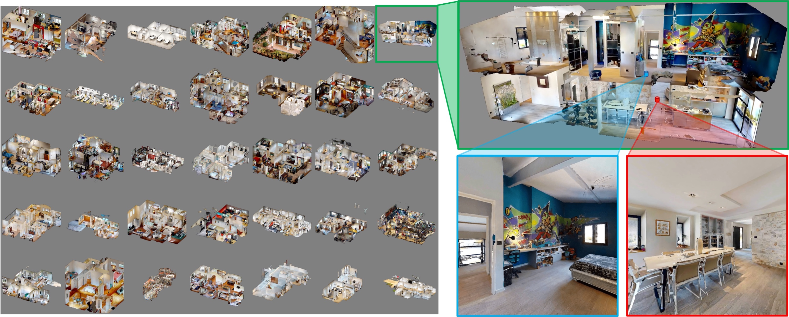

## Introduction



The Habitat-Matterport 3D (HM3D) dataset is a larger and more diverse dataset, curated for high-quality geometry and semantic richness. It comprises hundreds of high-resolution, richly annotated environments that provide a more challenging benchmark for ObjectNav. The HM3D-based ObjectNav benchmark emphasizes robustness and generalization due to the increased variability in scene structure, clutter, and scale. It supports more complex navigation scenarios, often requiring more advanced semantic reasoning and spatial memory capabilities. Evaluations use the same core metrics as MP3D (SR, SPL) but with greater emphasis on large-scale generalization.

## Benchmark Characteristics

### Dataset Scale and Scene Diversity

**Scene Quantity**
Contains 1,000 high-quality indoor scenes spanning 19 building types, including:

- Residential: apartments, villas
- Commercial: offices, restaurants
- Public spaces: hotel lobbies, classrooms

**Spatial Complexity**
Each scene averages:

- 5 rooms
- 15 object categories
  Supports complex tasks such as furniture layout reasoning and multi-room path planning.

**Data Precision**
Captured using Matterport Pro2 cameras, providing:

- Millimeter-level point cloud resolution
- Rich texture details (e.g., wall materials, furniture surface textures)

### Data Formats and Annotation Content

**Multimodal Data**

- 3D Textured Meshes: Usable for visual rendering and physics simulation
- Point Clouds: Include geometric coordinates and RGB color
- 2D Panoramas: 360° RGB images with depth maps (~200 per scene)
- Semantic Segmentation: Pixel-level annotations for 80 object categories (e.g., sofas, dining tables, bookshelves)

**Structured Metadata**

- Room types (e.g., bedroom, kitchen)
- Object attributes (e.g., material, dimensions)
- Spatial topology (e.g., door/window connections, room adjacency graphs)
- Interactive region labels (e.g., navigable floors, manipulable surfaces)

### Key Task Support

**Embodied Navigation**

- Goal-driven navigation: "Go to the blue sofa in the living room"
- Mapless exploration and localization (SLAM-related research)
- Obstacle avoidance and path optimization under dynamic or complex conditions

**3D Scene Understanding**

- Object detection and segmentation (3D bounding box prediction)
- Scene layout reconstruction (room structure and furniture arrangement inference)
- Cross-modal retrieval (e.g., matching text descriptions to 3D scene regions)

**Human-Computer Interaction Simulation**

- Object grasping and manipulation using physics-engine-based collision detection
- Scene

## Evaluation

SR (Success Rate): The proportion of episodes in which the agent successfully reaches the target object. A task is considered successful if the agent issues a “stop” action and the distance between the agent and the target object is less than 1 meter.

## Citation

```
@inproceedings{ramakrishnan2021hm3d,
    title={Habitat-Matterport 3D Dataset ({HM}3D): 1000 Large-scale 3D Environments for Embodied {AI}},
    author={Santhosh Kumar Ramakrishnan and Aaron Gokaslan and Erik Wijmans and Oleksandr Maksymets and Alexander Clegg and John M Turner and Eric Undersander and Wojciech Galuba and Andrew Westbury and Angel X Chang and Manolis Savva and Yili Zhao and Dhruv Batra},
    booktitle={Thirty-fifth Conference on Neural Information Processing Systems Datasets and Benchmarks Track},
    year={2021},
    url={https://arxiv.org/abs/2109.08238}
}
```
