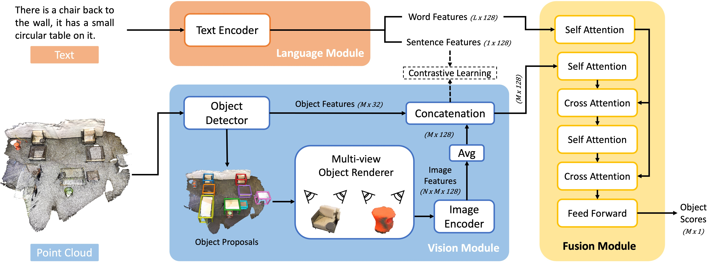

## Introduction



Multi3DRefer is a benchmark that extends 3D visual grounding to the task of localizing a flexible number of objects in real-world 3D scenes based on natural language descriptions. Unlike previous tasks that focus on identifying a single unique object, Multi3DRefer reflects more realistic scenarios where descriptions may refer to zero, one, or multiple objects simultaneously—an important capability for applications like robotic navigation and manipulation. Built upon and generalizing the ScanRefer dataset, Multi3DRefer contains over 61,900 descriptions referencing more than 11,600 objects, accompanied by a new evaluation metric tailored for multi-object localization. This benchmark provides a comprehensive platform for advancing multi-modal 3D scene understanding in complex, real-world environments.

## Benchmark Characteristics

### Task Design: Beyond Single-Object Limitation

**Multi-Object Support**
Supports text descriptions referring to 0, 1, or multiple 3D objects, beyond the traditional single-object grounding constraint.

- **Single-object**: "The brown sofa in the room"

- **Multi-object**: "The laptop and water cup on the desk"

- **Zero-object**: "An empty room with no chairs" (no matching objects exist in the scene)

**Real-World Alignment**
Simulates practical needs in robotics navigation and object rearrangement by supporting complex instruction understanding.
Example: "Pick up all red books on the shelf"

### Dataset Scale and Diversity

**Data Source**

- Extended from ScanNet indoor 3D point cloud scenes
- Covers 21 scene categories, including residential, office, etc.

**Annotation Scale**

- 61,926 text descriptions
- Referring to 11,609 3D objects
- Average of ~1.8 objects per description (maximum: 5 objects)
- Includes zero-object samples (≈5% of descriptions with no matching objects)

**Rich Description Types**

- Attribute-based: "all wooden chairs"
- Spatial relations: "the coffee table next to the sofa"
- Contextual combinations: "two small tables by the window"

## Evaluation

F1@0.25: The harmonic mean of precision and recall for object localization, where a predicted bounding box is considered correct if it overlaps with the ground truth by more than 25%.

## Citation

```
@inproceedings{zhang2023multi3drefer,
    author = {Zhang, Yiming and Gong, ZeMing and Chang, Angel X},
    title = {Multi3DRefer: Grounding Text Description to Multiple 3D Objects},
    booktitle = {Proceedings of the IEEE/CVF International Conference on Computer Vision (ICCV)},
    month = {October},
    year = {2023},
    pages = {15225-15236}
}
```
