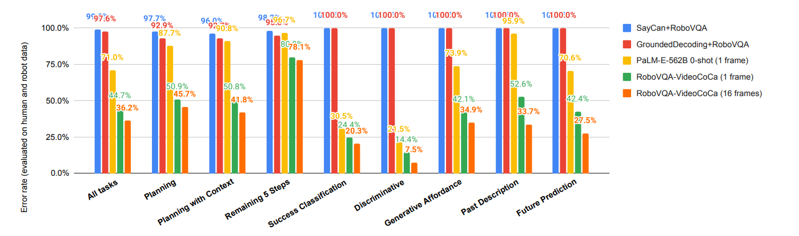

## Introduction



RoboVQA is a challenging benchmark for evaluating multimodal long-horizon reasoning capabilities in robotics through visual question answering. The benchmark addresses the gap between laboratory-controlled evaluations and real-world deployment scenarios by collecting data across diverse environments and embodiments. Unlike traditional narrow task-specific evaluations, RoboVQA covers a broad spectrum of reasoning tasks, including planning, affordance detection, success classification, and temporal understanding. The benchmark enables systematic evaluation of vision-language models' abilities to perform grounded reasoning in realistic robotic manipulation scenarios.

## Benchmark Characteristics

### Large-Scale Cross-Embodiment Dataset

The benchmark dataset contains 829,502 (video, text) pairs collected from 238 hours of video across 3 office buildings using multiple embodiments (robot, human, human-with-tool). The data includes 5,246 long-horizon episodes and 92,948 medium-horizon episodes with 29,520 unique instructions covering diverse manipulation tasks. This cross-embodiment approach enables evaluation of knowledge transfer capabilities between different forms of physical interaction.

### Bottom-Up Task Collection Methodology

RoboVQA employs a crowd-sourced bottom-up approach where real users provide long-horizon requests, resulting in naturally diverse and realistic task distributions. This methodology yields 2,722 unique long-horizon instructions and 26,798 unique medium-horizon instructions that reflect actual deployment scenarios. The approach achieves 2.2x higher collection throughput compared to traditional top-down methods while ensuring task relevance and diversity.

### Multi-Type Question Generation Framework

From each labeled video segment, the benchmark automatically generates 10 distinct types of question-answer pairs covering planning, affordance detection, success classification, future prediction, and past description tasks. This comprehensive question generation provides thorough evaluation coverage without additional human annotation costs. The variety of question types enables assessment of different reasoning capabilities required for robotic manipulation.

### Realistic Environment Diversity

The benchmark spans three different office buildings with varying layouts, lighting conditions, and object arrangements including kitchens, conference rooms, and workspaces. Environmental diversity ensures models are evaluated on their ability to generalize across different real-world settings rather than memorizing specific laboratory conditions. The realistic settings provide authentic evaluation scenarios that reflect actual service robot deployment environments.

### Chain-of-Thought Evaluation Structure

Long-horizon tasks are decomposed into sequences of medium-horizon steps that provide natural chain-of-thought evaluation for robotic reasoning. Each episode contains temporally-grounded reasoning steps that can be assessed as connected Visual Question Answering sequences. This structure enables evaluation of models' abilities to break down complex tasks into executable sub-goals and maintain coherent reasoning across extended time horizons.

## Evaluation

### VQA Benchmark with Human Validation

The benchmark evaluates model performance across nine distinct task types using human-validated ground truth answers stored in a centralized database. When model outputs don't match existing validated answers, human raters assess correctness while viewing the identical video segments and questions presented to models. This evaluation methodology ensures reliable assessment of reasoning capabilities including planning accuracy, affordance understanding, success detection, and temporal reasoning across diverse manipulation scenarios.

### Planning Benchmark with Intervention Metrics

The benchmark introduces a three-tier evaluation framework measuring intervention rates in increasingly realistic deployment scenarios. Evaluation progresses from pre-recorded video analysis (854 planning steps) to live robot teleoperation experiments to fully autonomous deployment with learned policies. The intervention rate metric quantifies both cognitive (high-level reasoning) and physical (low-level control) intervention requirements, providing a practical deployment-readiness assessment.

### Cross-Embodiment Transfer Evaluation

Systematic evaluation compares model performance when trained on different embodiment combinations (robot-only, human-only, mixed) to assess knowledge transfer capabilities across manipulation forms. The benchmark reveals that models trained on human demonstration data can achieve meaningful performance on robot tasks despite embodiment differences. Cost-benefit analysis demonstrates that strategic mixing of human and robot training data can achieve comparable performance to robot-only training while significantly reducing collection costs.

## Citation

```
@inproceedings{sermanet2024robovqa,
  title={Robovqa: Multimodal long-horizon reasoning for robotics},
  author={Sermanet, Pierre and Ding, Tianli and Zhao, Jeffrey and Xia, Fei and Dwibedi, Debidatta and Gopalakrishnan, Keerthana and Chan, Christine and Dulac-Arnold, Gabriel and Maddineni, Sharath and Joshi, Nikhil J and others},
  booktitle={2024 IEEE International Conference on Robotics and Automation (ICRA)},
  pages={645--652},
  year={2024},
  organization={IEEE}
}
```
