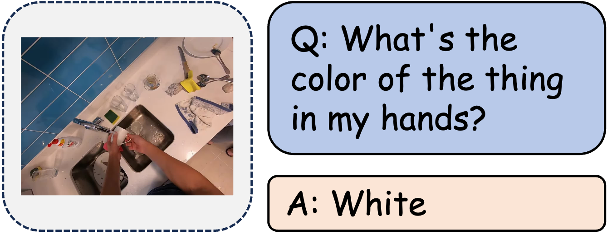

| **Benchmark** | **Capability Dimension** |
| ------------- | ------------------------ |
| VSI-Bench     | Object Size              |
| OpenEQA       | Attribute Recognition    |
| UniEQA        | Object Property          |
| PhyBlock      | Shape/Color/Size         |

