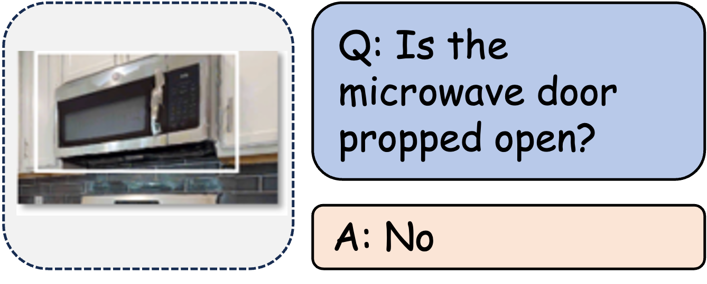

| **Benchmark** | **Capability Dimension** |
| ------------- | ------------------------ |
| ERQA          | State Estimation         |
| OpenEQA       | Object State Recognition |
| UniEQA        | Object State             |

