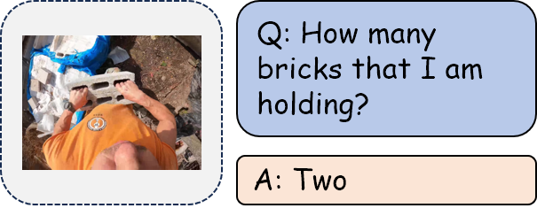

| **Benchmark** | **Capability Dimension**              |
| ------------- | ------------------------------------- |
| VSI-Bench     | Object Count                          |
| PhyBlock      | Number/Object Counting/Layer Counting |

