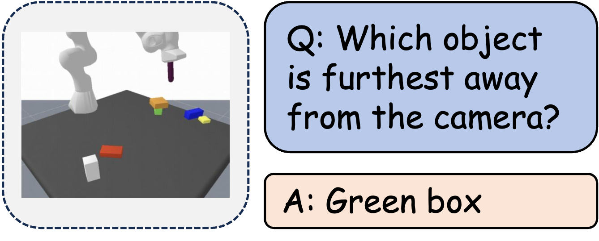

| **Benchmark** | **Capability Dimension**            |
| ------------- | ----------------------------------- |
| VSI-Bench     | Relative Distance/Absolute Distance |
| PhyBlock      | Absolute Positions                  |

