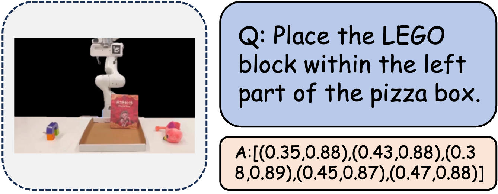

| **Benchmark** | **Capability Dimension**                        |
|---------------|-------------------------------------------------|
| Where2Place   | Affordance Prediction                           |
| RoBoVQA       | Discriminative Affordance/Generative Affordance |
| UniEQA        | Affordance                                      |
| PhyBlock      | Affordance                                      |
| VABench-Point | Affordance Prediction                           |

