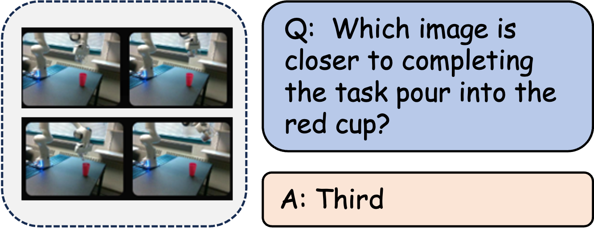

| **Benchmark** | **Capability Dimension**                                              |
| ------------- | --------------------------------------------------------------------- |
| ERQA          | Task Reasoning/Action Reasoning                                       |
| RoBoVQA       | Success/Future prediction                                             |
| UniEQA        | Task-related Object Reasoning/Situated Reasoning/Closed-loop Planning |
| PhyBlock      | Predictive                                                            |

