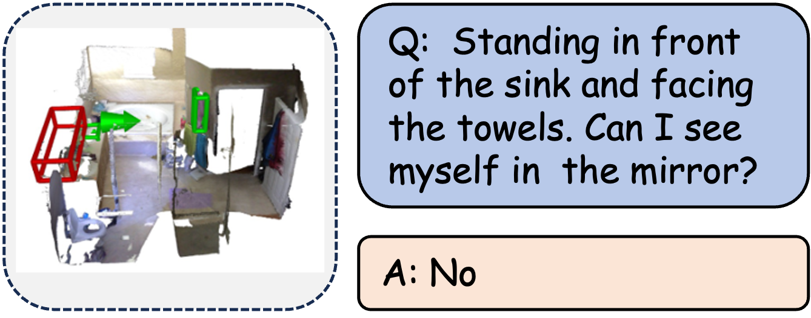

| **Benchmark** | **Capability Dimension**                         |
| ------------- | ------------------------------------------------ |
| ERQA          | Spatial Reasoning                                |
| OpenEQA       | Spatial Reasoning                                |
| SQA3D         | Situated Reasoning                               |
| PhyBlock      | Viewpoint/Relative Dependency/Relative Rotations |
| MineAnyBuild  | Spatial Reasoning                                |

