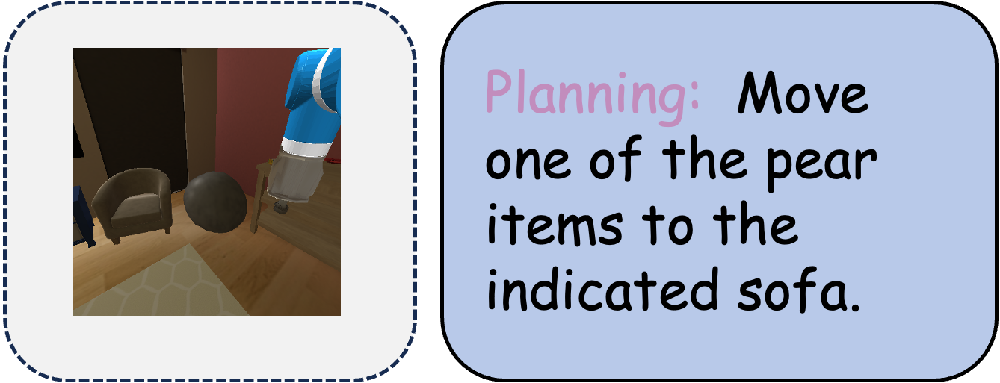

| **Benchmark** | **Capability Dimension**                         |
| ------------- | ------------------------------------------------ |
| VSI-Bench     | Route Plan                                       |
| RoBoVQA       | Planning/planning with context/remaining steps   |
| UniEQA        | Open-loop Planning                               |
| EB-ALFRED     | Base Capability/complex Instruction/long Horizon |
| EB-Habitat    | Base Capability/complex Instruction/long Horizon |

