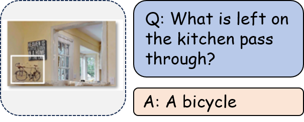

| **Benchmark** | **Capability Dimension** |
| ------------- | ------------------------ |
| ERQA          | Pointing                 |
| OpenEQA       | Object Recognition       |
| UniEQA        | Object Type              |
| PhyBlock      | Type Counting            |

