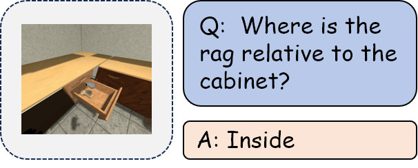

| **Benchmark** | **Capability Dimension** |
| ------------- | ------------------------ |
| VSI-Bench     | Relative Direction       |
| ERQA          | Multi-view Reasoning     |
| UniEQA        | Spatial Perception       |
| Scan2Cap      | Dense Captioning         |
| PhyBlock      | Relative Positions       |

