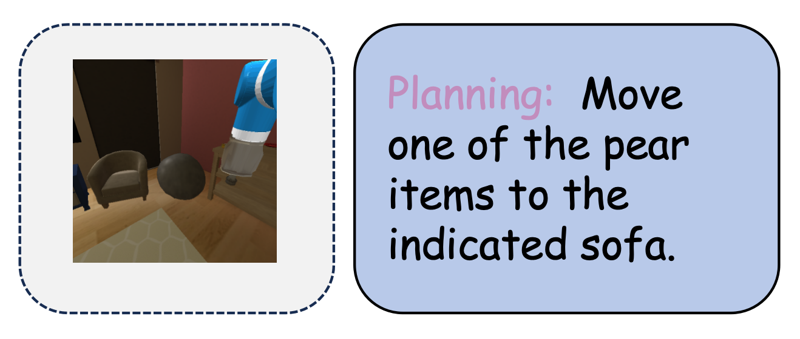

| **Benchmark** | **Capability Dimension** |
|---------------|--------------------------|
| VSI-Bench | Route Plan |
| RoBoVQA | Planning/planning with context/remaining steps |
| UniEQA | Open-loop Planning |
| EB-ALFRED | Base Capability/complex Instruction/long Horizon |
| EB-Habitat | Base Capability/complex Instruction/long Horizon |

